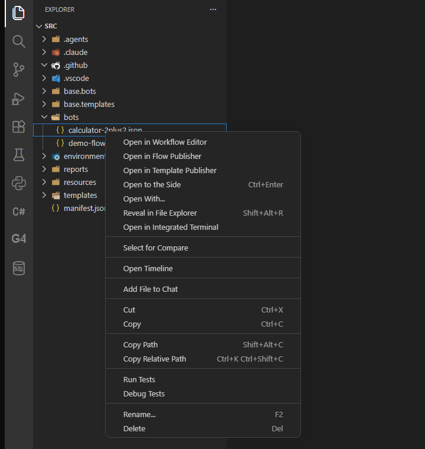
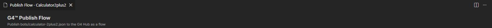
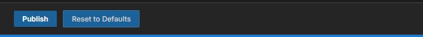

# Module 1: Open the Flow Publisher

[⬅ Back to overview](README.md)

⏱️ **About 3 minutes**

Every flow starts from a bot file. In this module you'll open the Flow Publisher for one of your bots and learn what each part of the page is for. You won't change or publish anything yet.

In this module, you will:

- Right-click a bot and open the Flow Publisher
- Recognize the parts of the page: header, sections, and the action bar
- Learn what the two buttons at the bottom do

---

## Step 1: Find your bot in the Explorer

In VS Code, look at the **Explorer** on the left. Expand the **`bots`** folder. Each `.json` file in it is one of your bots.

> **⚠️ Important:** Only files inside the **`bots`** folder can be published. The files in **`base.bots`** are starting points that come with G4 — they do not have this menu entry.

---

## Step 2: Open the publisher

Right-click the bot you want to share (we use `calculator-2plus2.json` here) and choose **Open in Flow Publisher**.

A small progress message appears while G4 reads the bot. Then a new tab opens.

> **💡 Tip:** If the publisher for that bot is already open, G4 simply brings its tab to the front instead of opening a second one.
>
> **📝 Note:** You will also see **Open in Workflow Editor** (the visual builder from the quick start) and **Open in Template Publisher** (for sharing part of a bot). Pick **Open in Flow Publisher** for the whole bot.

---

## Step 3: Read the page header

The new tab is called **Publish Flow** followed by the flow's name. At the top of the page, a header tells you which file you are publishing and where it is going.

Here the header reads **Publish bots/calculator-2plus2.json to the G4 Hub as a flow**. Always glance at it: it confirms you opened the right bot.

---

## Step 4: Meet the sections

Under the header, the form is split into **sections**. Click a section's title to open or close it.

| Section | What it holds |
| --- | --- |
| **Identity** | The flow's name, namespace, and version |
| **Description** | A short summary and a longer description |
| **Classification** | Categories, aliases, and platforms |
| **Author & Links** | Who made it and where to learn more |
| **Parameters** | The blanks people fill in when they run the flow |
| **Context & Protocol** | Extra technical data (leave empty unless you need it) |
| **Automation** | The bot itself, exactly as it will be published |

A red star (**\***) next to a label means the box is **required**. The next modules take the sections one at a time.

---

## Step 5: Know the two buttons

At the bottom of the page is the **action bar**.

- **Publish** sends the flow to the Hub.
- **Reset to Defaults** puts every box back the way it was when you opened the page. Use it when you want a fresh start.

> **💡 Tip:** Nothing is sent anywhere until you press **Publish**. Feel free to click around and type — **Reset to Defaults** undoes it all.

---

## ✔ Check your work

- [ ] You opened the Flow Publisher by right-clicking a bot in the `bots` folder
- [ ] The tab is named **Publish Flow** and the header shows your bot's file name
- [ ] You can see the **Identity** section and the **Publish** button

---

**Next up** 👉 [Module 2: Name and describe your flow](02-name-and-describe-your-flow.md)
