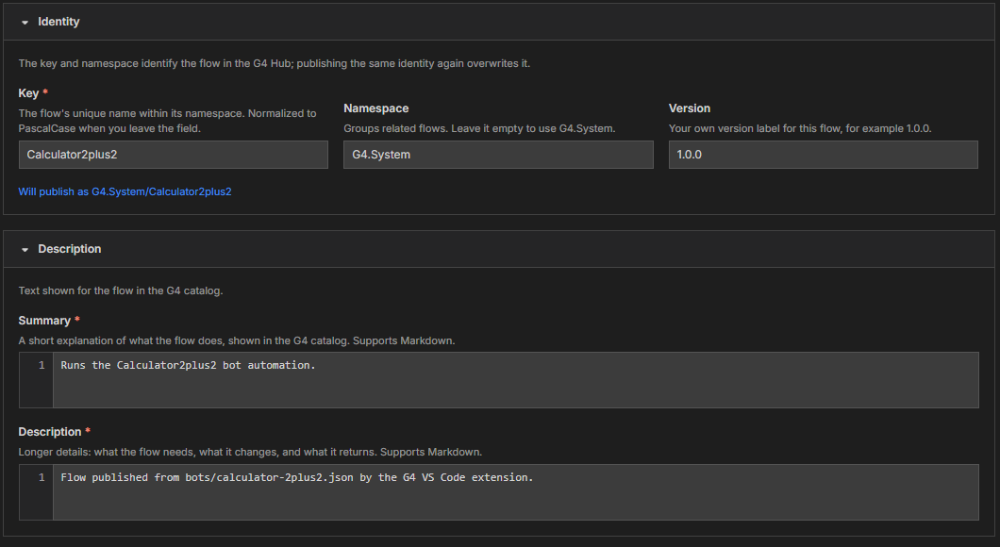

# Module 2: Name and describe your flow

[⬅ Back to overview](README.md) · [⬅ Module 1](01-open-the-flow-publisher.md)

⏱️ **About 4 minutes**

A flow needs a name that is easy to say and a description that tells people what it does. G4 fills in sensible starting values from your bot file — here you check them and improve them.

In this module, you will:

- Understand the **key**, **namespace**, and **version**
- Read the "Will publish as" line
- Write a clear **summary** and **description**

---

## Step 1: Check the Identity section

Open the **Identity** section. It has three boxes.



- **Key** — the flow's unique name. G4 builds it from your file name (`calculator-2plus2.json` becomes **Calculator2plus2**). When you leave the box, G4 tidies what you typed into **PascalCase**: words joined together, each starting with a capital letter, with spaces and dashes removed.
- **Namespace** — a group name for related flows. If you leave it empty, G4 uses **G4.System**.
- **Version** — your own label, for example **1.0.0**. Change it when you publish an improved version.

> **⚠️ Important:** The key and namespace together are the flow's identity. **Publishing the same identity again overwrites the earlier flow.** That is handy for updates, and risky if you reuse a name by accident.

---

## Step 2: Read the "Will publish as" line

Just under the three boxes, a blue line shows the final identity, for example:

```text
Will publish as G4.System/Calculator2plus2
```

This is the exact address the flow will have in the Hub. If it is not what you want, change the **Key** or **Namespace** and watch the line update.

---

## Step 3: Write the summary

Open the **Description** section. The **Summary** is one or two sentences that appear when people browse the catalog.

G4 starts you off with a sentence such as **Runs the Calculator2plus2 bot automation.** Replace it with something a colleague would understand, for example:

```text
Adds two numbers in the Windows Calculator and checks the result.
```

The box is required. Both text boxes support **Markdown** — a simple way to format text (`**bold**`, lists, links). Plain sentences work perfectly well.

---

## Step 4: Write the description

The **Description** box is for the longer story: what the flow needs before it starts, what it changes, and what it gives back. A few lines are plenty.

> **💡 Tip:** Write for someone who has never seen your bot. Mention anything they must prepare first, such as "Calculator must be installed" or "Log in to the app before running".
>
> **📝 Note:** Each line you type becomes one entry in the published text, so a new line is a new paragraph in the catalog.

---

## ✔ Check your work

- [ ] The **Key** has no spaces and the **Will publish as** line shows the identity you want
- [ ] The **Namespace** is either empty (G4.System) or a name you chose on purpose
- [ ] The **Summary** and **Description** boxes both contain text — neither shows a red **Required.** message

---

**Next up** 👉 [Module 3: Make your flow easy to find](03-make-your-flow-easy-to-find.md)
