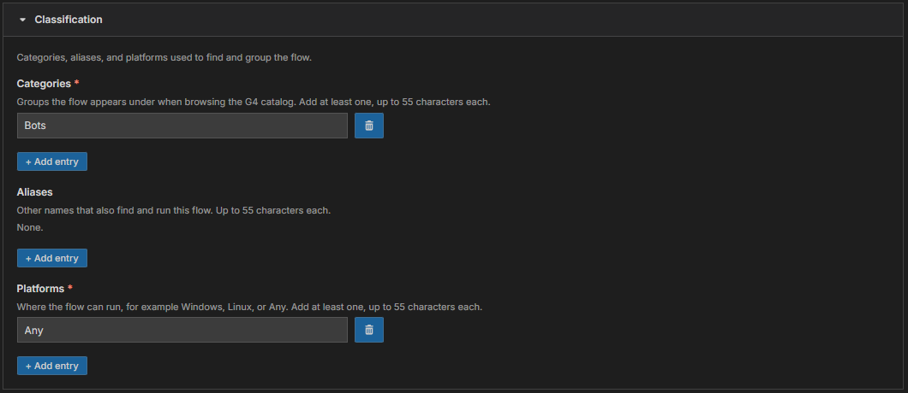
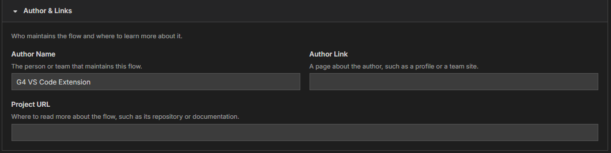

# Module 3: Make your flow easy to find

[⬅ Back to overview](README.md) · [⬅ Module 2](02-name-and-describe-your-flow.md)

⏱️ **About 3 minutes**

A catalog is only useful if people can find things in it. In this module you'll file your flow under **categories**, tell G4 where it can run, and add the author's details.

In this module, you will:

- Choose categories, aliases, and platforms
- Add the author and a project link
- Learn the limits that the form checks for you

---

## Step 1: Fill in Classification

Open the **Classification** section. It has three lists.

- **Categories** *(required)* — the groups your flow appears under when people browse, for example **Bots** or **Finance**. Add at least one.
- **Aliases** *(optional)* — other names that also find your flow. If people might search for "calc", add **calc** as an alias.
- **Platforms** *(required)* — where the flow can run: **Windows**, **Linux**, or **Any**. Add at least one.

To add an item, press **+ Add entry** and type in the new box. To remove one, press the little trash-can button next to it.

> **💡 Tip:** G4 starts you with **Bots** and **Any**. If your flow drives a Windows-only program such as Calculator, change **Any** to **Windows** so nobody tries it on Linux.

---

## Step 2: Know the list rules

Every entry in these three lists follows two simple rules. The form shows a red message right under the box if you break one:

- Up to **55 characters** per entry
- **No repeats** — an entry that matches an earlier one (ignoring capital letters) is flagged

Empty entries are ignored, so a stray blank box does no harm.

---

## Step 3: Add the author and a link

Open the **Author & Links** section.

- **Author Name** — the person or team who looks after the flow. G4 fills in **G4 VS Code Extension**; replace it with your own name or your team's name.
- **Author Link** *(optional)* — a page about the author, such as a profile or a team site.
- **Project URL** *(optional)* — where to read more, such as a repository or documentation page.

Links must be complete web addresses that start with `https://` or `http://`. If one is not, the form tells you when you publish.

> **📝 Note:** The **Context & Protocol** section below holds extra technical data. For an everyday flow, leave it empty.

---

## ✔ Check your work

- [ ] **Categories** and **Platforms** each have at least one entry
- [ ] The **Author Name** is a name you recognize as yours or your team's
- [ ] Any link you typed starts with `https://`

---

**Next up** 👉 [Module 4: Add parameters](04-add-parameters.md)
