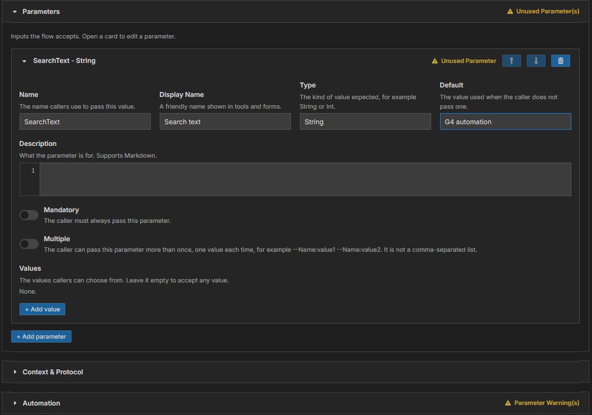

# Module 4: Add parameters

[⬅ Back to overview](README.md) · [⬅ Module 3](03-make-your-flow-easy-to-find.md)

⏱️ **About 5 minutes**

Imagine your bot searches a website for a word. Today the word is typed inside the bot. A **parameter** turns that word into a blank that whoever runs the flow can fill in — without touching the bot.

You don't need parameters for every flow. If your bot always does exactly the same thing, skip to [Module 5](05-review-the-automation.md). If you do want one, this module shows you how.

In this module, you will:

- Add a parameter and fill in its details
- Use the parameter inside the automation with a **token**
- Understand the yellow **warnings** and why they never stop you

---

## Step 1: Add a parameter

Open the **Parameters** section. If your bot has none, it says **None.** Press **+ Add parameter**. A new card opens.

Fill in the boxes at the top:

- **Name** — the word callers use to pass the value, for example `SearchText`. Use letters and digits, no spaces.
- **Display Name** — a friendly label for forms and tools, for example **Search text**.
- **Type** — the kind of value, for example **String** (any text) or **Int** (a whole number).
- **Default** — the value used when the caller passes nothing.



The card's title follows what you type: **SearchText - String**.

---

## Step 2: Describe the parameter

Under the four boxes, four more settings are available:

- **Description** — what the parameter is for, in a sentence.
- **Mandatory** — switch it on if the caller **must** always provide a value.
- **Multiple** — switch it on if the caller may pass the parameter more than once. This is for repeated values, not a comma-separated list.
- **Values** — a list of allowed choices. Press **+ Add value** to add one. Leave the list empty to accept anything.

To reorder parameters, use the up and down arrow buttons on the card. To delete one, press the trash-can button.

---

## Step 3: Use the parameter in the automation

A parameter does nothing until the automation **uses** it. You use it by writing a **token** where the value belongs:

```text
{{$ Parameters.SearchText }}
```

Rules for a token:

- Start with `{{$` and end with `}}`
- Leave **one space** after `{{$` and one space before `}}`
- Write `Parameters.` followed by the parameter's name exactly as it appears in the **Name** box

The **Automation** section (see [Module 5](05-review-the-automation.md)) shows the bot text. That is where a token such as the one above belongs, for example inside a rule's argument.

> **💡 Tip:** Capital letters in the word `Parameters` and in the name don't matter — `{{$ parameters.searchtext }}` is understood too. Matching the original spelling just keeps things tidy.

---

## Step 4: Read the warnings

Look at the picture above. A yellow triangle with **Unused Parameter** appears on the card, **Unused Parameter(s)** on the section header, and a **Parameter Warning(s)** badge on the **Automation** section. That's because we created `SearchText` but no token uses it yet.

G4 checks three things:

| Warning | What it means | How to fix it |
| --- | --- | --- |
| **Unused parameter** | You created a parameter that nothing uses | Add its token to the automation, or delete the parameter |
| **Unknown parameter** | The automation uses a name that has no parameter card | Add a card with that name, or fix the spelling |
| **Broken token** | Something looks like a token but is not written correctly | Fix the braces and spaces: `{{$ Parameters.Name }}` |

> **📝 Note:** Warnings never block you. When you press **Publish**, G4 asks once whether to continue (see [Module 6](06-publish-your-flow.md)). They are there to catch typos before other people run your flow.

---

## ✔ Check your work

- [ ] You know the difference between a **parameter** (a blank callers fill in) and a **token** (where the blank is used)
- [ ] Any parameter you added has a **Name**
- [ ] No yellow warnings remain — or you know why each one is there

---

**Next up** 👉 [Module 5: Review the automation](05-review-the-automation.md)
