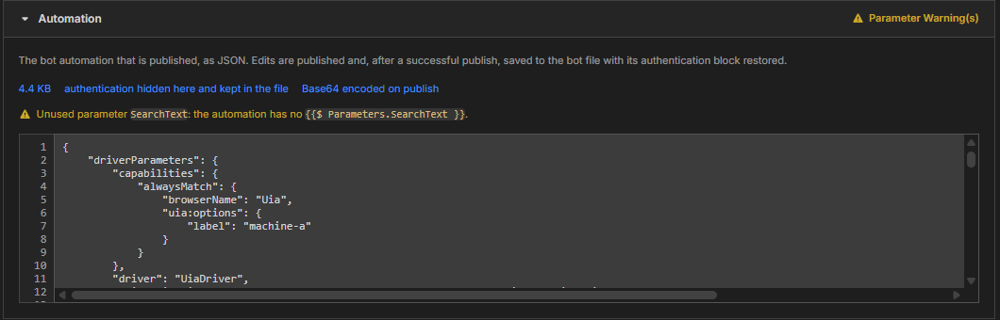

# Module 5: Review the automation

[⬅ Back to overview](README.md) · [⬅ Module 4](04-add-parameters.md)

⏱️ **About 2 minutes**

The last section, **Automation**, shows the bot itself — exactly what will be published. Most of the time you only read it. In this module you'll learn what the facts above the text mean and why you will not see your login token.

In this module, you will:

- Read the facts shown above the automation text
- Understand why the **authentication** block is hidden
- Know what happens to your bot file after you publish

---

## Step 1: Open the Automation section

Scroll to the bottom of the form and open **Automation**.

Under the title you'll see a sentence and three small facts in blue:

- **4.4 KB** — the size of the automation. Very large bots take longer to publish.
- **authentication hidden here and kept in the file** — your login details are not shown on this page.
- **Base64 encoded on publish** — before sending, G4 converts the automation into a compact text form the Hub expects. You don't need to do anything for this.

Below the facts, the bot appears as **JSON**, a plain-text format made of names and values in curly braces. You can scroll through it.

---

## Step 2: Understand the hidden authentication

Your bot normally contains an **authentication** block — for example the **token** you saved in the quick start. A token is a secret, so G4 keeps it out of the published flow:

- It is **not shown** in this box.
- It is **not sent** to the Hub.
- It **stays in your bot file**, untouched.

> **⚠️ Important:** Do not paste secrets such as passwords or tokens into this box or into the **Description**. Anything you type here is published for others to read.

---

## Step 3: Edit only when you must

You can type directly in the JSON box — for example, to add a token like `{{$ Parameters.SearchText }}` (see [Module 4](04-add-parameters.md)). If you do, keep these habits:

- Change only the part you mean to change; JSON needs every comma and brace to be in place.
- If the box shows a red error about invalid JSON, fix it before publishing. The form will not publish text it cannot read.

> **💡 Tip:** Not comfortable editing JSON? Make the change in the **Workflow Editor** (right-click the bot, then **Open in Workflow Editor**), save, and open the Flow Publisher again.

---

## Step 4: Know what happens to your bot file

After a successful publish, G4 **saves the automation back to your bot file**, with your authentication block put back exactly as it was. That keeps the file and the published flow in step.

Two safety rules apply:

- If nothing changed, G4 leaves the file alone.
- If the bot is open in an editor tab with **unsaved changes**, G4 does **not** overwrite it. You'll see a warning, and your unsaved work stays safe.

---

## ✔ Check your work

- [ ] You found the **Automation** section and its size
- [ ] You know your token is hidden here and stays in the bot file
- [ ] You know the bot file is saved after a successful publish, unless it has unsaved edits

---

**Next up** 👉 [Module 6: Publish your flow](06-publish-your-flow.md)
