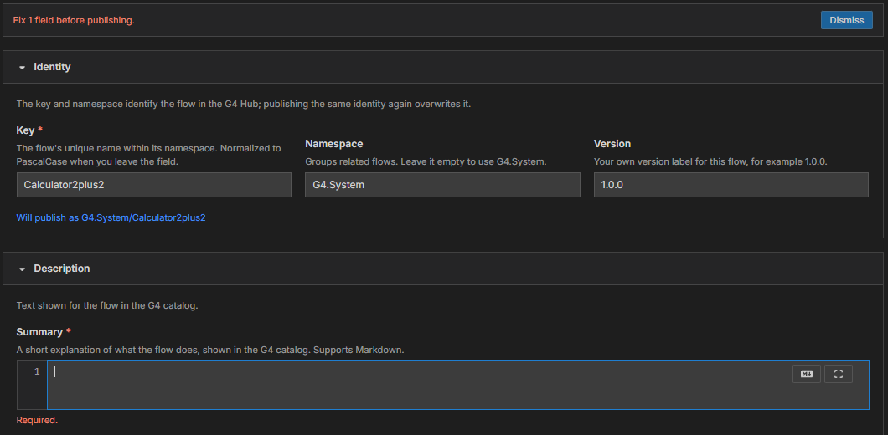
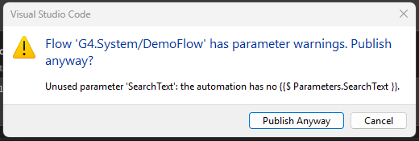

# Module 6: Publish your flow

[⬅ Back to overview](README.md) · [⬅ Module 5](05-review-the-automation.md)

⏱️ **About 4 minutes**

Everything is filled in. Time to press **Publish**. In this module you'll see what the form checks first, how G4 handles warnings, and how to read the result.

In this module, you will:

- Fix missing required boxes
- Answer the warning question
- Read the success or failure message

---

## Step 1: Press Publish

Press **Publish** at the bottom of the page. The button changes to **Publishing…** while G4 works.

Before anything is sent, the form checks itself.

---

## Step 2: Fix required boxes

If a required box is empty, nothing is sent. A red message appears at the top — **Fix 1 field before publishing.** — and the form opens the section with the problem and marks the box.

Fill in the marked box and press **Publish** again. The most common causes are an empty **Key**, **Summary**, **Description**, **Categories**, or **Platforms**.

> **💡 Tip:** Press **Dismiss** on the red banner to hide it. The marked boxes stay marked until you fix them.

---

## Step 3: Answer the warning question

If the form has parameter warnings (see [Module 4](04-add-parameters.md)), VS Code asks one question in a box in the middle of the window. The box lists every warning:

- **Publish Anyway** — continue and send the flow.
- **Cancel** — stop this publish. Nothing is sent, and you can fix the warnings first.

> **📝 Note:** The box stays until you answer it. Closing it with the **X** is the same as **Cancel**.

---

## Step 4: Read the result

When the Hub answers, a message appears at the top of the page:

- **Success** — the message reads **Published G4.System/YourKey.** If your bot file was saved, it adds **Saved bots/your-file.json.** You can close the tab or keep editing and publish again; the same key overwrites the earlier version.
- **Failure** — the message starts with **The Hub rejected the flow:** and gives the reason. When the reason points at a specific box, that box is marked in red. Fix it and publish again.

> **⚠️ Important:** Publishing is the one step that changes something outside your computer. Check the **Will publish as** line in [Module 2](02-name-and-describe-your-flow.md) one last time — it shows exactly which flow you are about to create or overwrite.

---

## Step 5: Start over if you need to

Pressed something by mistake? **Reset to Defaults** restores every box to how it was when the page opened. After a successful publish, "defaults" means the flow you just published.

---

## ✔ Check your work

- [ ] You pressed **Publish** and the form either published or told you which box to fix
- [ ] You know how to answer **Publish Anyway** and **Cancel**
- [ ] You can find the result message at the top of the page

---

**You did it** 🎉 Your bot is now a flow in the G4 Hub. Next, learn how to share just a **piece** of a bot: [Publish a Template](../publish-a-template/README.md).
