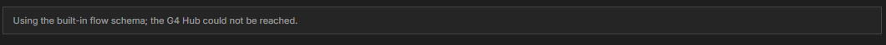

# Troubleshooting: Publish a Flow

[⬅ Back to overview](README.md)

Find your symptom below. Each entry says what you see, why it happens, and what to do.

---

## "Open in Flow Publisher" is missing from the right-click menu

- **Symptom:** You right-click a file and the menu has no **Open in Flow Publisher**.
- **Cause:** The entry only appears for `.json` files inside the project's **`bots`** folder. It does not appear for folders, for other file types, or for the starter files in **`base.bots`**.
- **Fix:** Make sure the bot is in the `bots` folder and ends in `.json`. To start from a base file, copy it into `bots` first. See [Module 1](01-open-the-flow-publisher.md).

---

## A grey note says "Using the built-in flow schema; the G4 Hub could not be reached"

- **Symptom:** A grey box at the top of the page reads **Using the built-in flow schema; the G4 Hub could not be reached.**

  

- **Cause:** When the page opens, G4 asks the Hub what a flow looks like. The Hub did not answer, so the page used its own built-in copy.
- **Fix:** You can keep going — the form works the same. Publishing, however, needs the Hub. If **Publish** fails, check that the G4 engine is running (the status bar should say **G4 Engine is Connected and Ready**) and open the page again.

---

## "Fix 1 field before publishing"

- **Symptom:** A red banner at the top, and a red message such as **Required.** under a box.
- **Cause:** A required box is empty, or a value broke a rule (for example a link that is not a full address).
- **Fix:** Fix the marked box and press **Publish** again. See [Module 6](06-publish-your-flow.md).

---

## Yellow warnings: "Unused Parameter" or "Parameter Warning(s)"

- **Symptom:** Yellow triangles on the **Parameters** section, a parameter card, or the **Automation** section.
- **Cause:** A parameter is not used by the automation, a token names a parameter that does not exist, or a token is written incorrectly.
- **Fix:** Follow the table in [Module 4](04-add-parameters.md). Warnings never block publishing, so you can also choose **Publish Anyway**.

---

## "Could not reach the G4 Hub"

- **Symptom:** The result message starts with **Could not reach the G4 Hub**, followed by a short reason such as **ECONNREFUSED** or **timed out**.
- **Cause:** The Hub did not answer: it is not running, or the address in `manifest.json` is wrong.
- **Fix:** Check that the G4 engine is running (the status bar should say **G4 Engine is Connected and Ready**) and that the **Connection** settings point to it, then press **Publish** again.

---

## "The Hub rejected the flow"

- **Symptom:** The result message starts with **The Hub rejected the flow:**.
- **Cause:** The Hub checked the flow and found a problem — for example a name it does not accept or an invalid value.
- **Fix:** Read the reason in the message. If a box is marked in red, fix that box. Then press **Publish** again.

---

## "…has unsaved changes that could not be saved, so the flow was not published"

- **Symptom:** The result message is red, and nothing was published.
- **Cause:** The bot is open in another tab with unsaved edits. G4 saves that tab before publishing, and this time VS Code could not save it — for example, the file is read-only.
- **Fix:** Switch to the bot's tab and save it yourself (or close it without saving), then press **Publish** again.

---

**Still stuck?** Open the **Output** panel in VS Code (**View**, then **Output**) and choose **G4 Extension** (or **G4 Hub**) from the drop-down. These logs record each publish attempt and the reason it failed.
