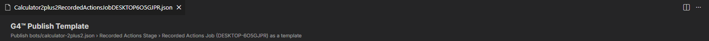
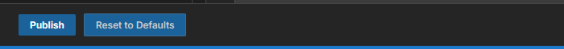

# Module 1: Open the Template Publisher

[⬅ Back to overview](README.md)

⏱️ **About 4 minutes**

You can open the Template Publisher from two places: from a **bot** (to make a new template) or from an existing **template file** (to update it). In this module you'll open it, choose which part of a bot to use, and learn the layout.

In this module, you will:

- Open the Template Publisher from a bot
- Choose a stage and a job when the bot has several
- Recognize the tab, header, sections, and buttons

---

## Step 1: Right-click a bot

In the **Explorer**, expand the **`bots`** folder, right-click the bot you want to reuse (we use `calculator-2plus2.json`), and choose **Open in Template Publisher**.

> **⚠️ Important:** The entry appears for `.json` files inside the **`bots`** folder and inside the **`templates`** folder. It does not appear for the starter files in **`base.bots`**.
>
> **📝 Note:** To update a template you already published, right-click its file in the **`templates`** folder instead. The same page opens, filled with that template's stored values.

---

## Step 2: Choose a stage and a job

A bot is organized like this: a bot has **stages**, a stage has **jobs**, and a job has **rules** (the individual steps). A template is built from **one job's rules**.

- If the bot has only one stage, and that stage has one job, G4 takes it without asking.
- If there are several, VS Code shows a list at the top of the window. Each choice looks like `#2 · Search Stage`. The number is the position in the bot, counting from 1; it tells apart two items that share a name. Pick one and press **Enter**.

G4 takes **all the rules** of the job you pick — including rules nested inside others. Press **Esc** to cancel.

---

## Step 3: Read the tab and the header

A new tab opens. Its name is the **template's file name**, for example `Calculator2plus2RecordedActionsJobDESKTOP6O5GJPR.json` — the file G4 will save when you publish. The name changes as you edit the **File Name** box in [Module 2](02-name-save-and-describe.md).

The header repeats where the rules came from: **bots/calculator-2plus2.json › Recorded Actions Stage › Recorded Actions Job**. Check that it names the part you meant to reuse.

---

## Step 4: Meet the sections and buttons

Below the header the form is split into sections. Click a title to open or close it.

| Section | What it holds |
| --- | --- |
| **Identity** | The key, namespace, and version |
| **Template File** | The file name the template is saved under |
| **Description** | A summary and a longer description |
| **Classification** | Categories, aliases, and platforms |
| **Author & Links** | Who made it, and where to learn more |
| **Properties** | The fixed rule settings the template exposes |
| **Parameters** | Your own named blanks |
| **Rules** | The steps that are published |
| **Examples** | At least one example of calling the template |
| **Context & Protocol** | Extra technical data (leave empty for now) |

At the bottom are two buttons.

- **Publish** sends the template to the Hub.
- **Reset to Defaults** puts every box back the way it was when the page opened.

> **💡 Tip:** Nothing leaves your computer until you press **Publish**. Explore freely, and use **Reset to Defaults** if you want a clean start.

---

## ✔ Check your work

- [ ] You opened **Open in Template Publisher** from a bot in the `bots` folder
- [ ] The header names the stage and job you wanted
- [ ] You can see the **Identity** and **Template File** sections and the **Publish** button

---

**Next up** 👉 [Module 2: Name, save, and describe](02-name-save-and-describe.md)
