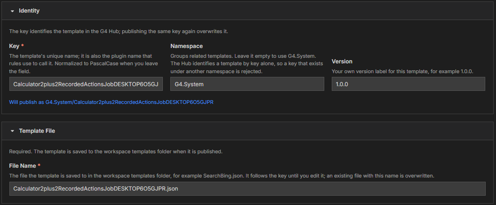
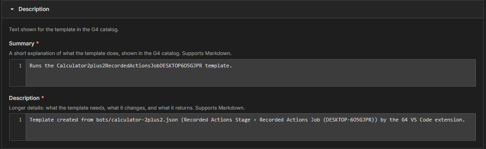

# Module 2: Name, save, and describe

[⬅ Back to overview](README.md) · [⬅ Module 1](01-open-the-template-publisher.md)

⏱️ **About 4 minutes**

A good template has a short name, a home in your project, and a description that makes sense to someone who has never seen your bot. G4 fills in starting values; here you check and improve them.

In this module, you will:

- Understand the **key**, **namespace**, and **version**
- Choose the template's **file name**
- Write a **summary** and **description**

---

## Step 1: Check the Identity section

- **Key** — the template's unique name. It is also the name that **rules use to call the template**. G4 builds a long key from your bot's file name plus the job name; shorten it to something you would like to type, such as **SearchBing**. When you leave the box, G4 tidies it into **PascalCase**: words joined together, each starting with a capital letter.
- **Namespace** — a group name for related templates. Leave it empty to use **G4.System**.
- **Version** — your own label, for example **1.0.0**.

A blue line under the boxes shows the final address, for example **Will publish as G4.System/SearchBing**.

> **⚠️ Important:** The Hub identifies a template by its **key alone**. If a template with the same key already exists under a **different** namespace, the Hub rejects yours. Publishing the same key again in the same namespace **overwrites** the earlier template.
>
> **📝 Note:** When a template with this key already exists, a notice appears above the form with an option to **load its stored values**, so you can start from what is already published.

---

## Step 2: Choose the file name

Open the **Template File** section. The **File Name** box is required when you started from a bot. It names the file that G4 saves in your project's **`templates`** folder after you publish.

- It starts as your key plus `.json`, for example `SearchBing.json`, and **follows the key** until you type your own name.
- It must be a plain name ending in `.json` — no folders and no special characters such as `\ / : * ? " < > |`.
- If a file with that name already exists, it is **overwritten**.

The tab at the top of VS Code shows this name and changes as you type.

> **💡 Tip:** Use the same name as the key. It keeps your `templates` folder easy to scan.

---

## Step 3: Write the summary and the description

Open the **Description** section.

- **Summary** *(required)* — one or two sentences shown in the catalog, for example *Searches Bing for a word and opens the first result.*
- **Description** *(required)* — the longer story: what the template needs, what it changes, and what it gives back.

Both support **Markdown** — a simple way to format text (`**bold**`, bullet lists, links). Plain sentences are fine. Each line you type is published as one entry.

> **💡 Tip:** Write for a colleague who has never seen your bot. Mention anything they must prepare first, such as "Chrome must be open".

---

## Step 4: Classify and credit the template

The **Classification** and **Author & Links** sections work exactly as they do for flows: add at least one **category** and one **platform**, optional aliases, and the author's name. See [Module 3 of Publish a Flow](../publish-a-flow/03-make-your-flow-easy-to-find.md) for pictures and the rules for each box.

---

## ✔ Check your work

- [ ] The **Key** is short, has no spaces, and the **Will publish as** line shows what you want
- [ ] The **File Name** ends in `.json`
- [ ] **Summary**, **Description**, **Categories**, and **Platforms** are filled in

---

**Next up** 👉 [Module 3: Properties and parameters](03-properties-and-parameters.md)
