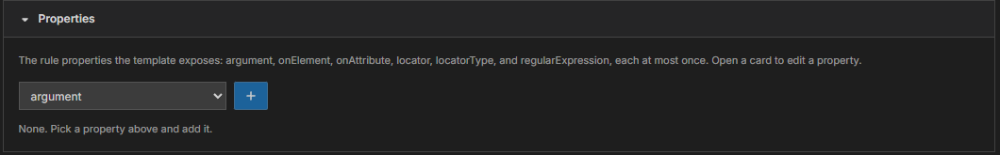
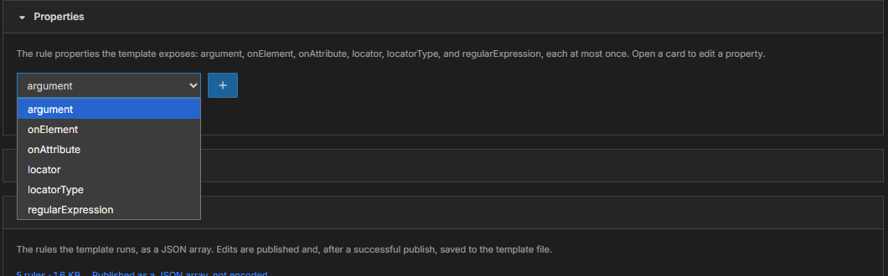
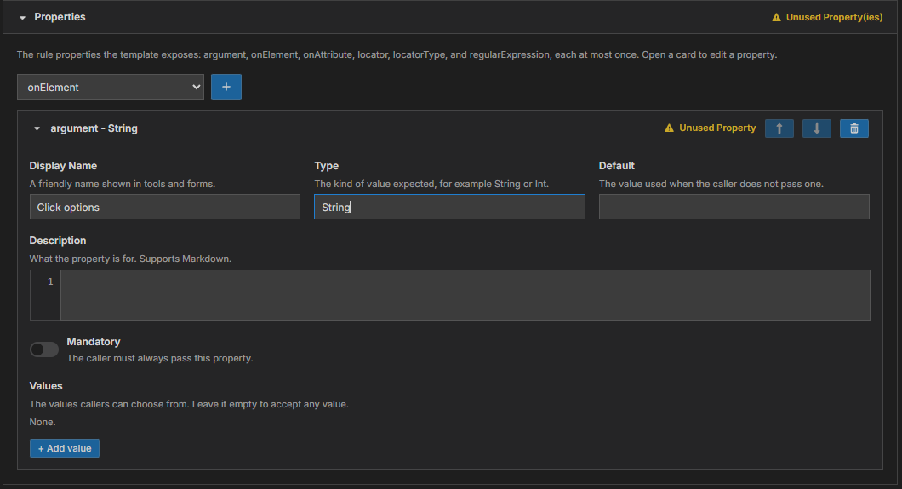

# Module 3: Properties and parameters

[⬅ Back to overview](README.md) · [⬅ Module 2](02-name-save-and-describe.md)

⏱️ **About 6 minutes**

When someone uses your template, they may need to hand it some information — which button to click, what text to type. A template can ask for that information in two ways: **properties** and **parameters**. They look similar on the page, but they mean different things.

In this module, you will:

- Tell **properties** and **parameters** apart
- Add properties from the picker
- Fill in a property card
- Add parameters of your own

---

## Step 1: Understand the difference

| | Properties | Parameters |
| --- | --- | --- |
| **What they are** | The settings every rule already has | Blanks you invent for your template |
| **Who decides the names** | G4 — there are exactly six | You |
| **How many** | Each one **at most once** | As many as you like |
| **How a rule uses them** | `{{$ Properties.argument }}` | `{{$ Parameters.SearchText }}` |

The six properties are:

- **argument** — the extra text or options given to an action
- **onElement** — the item on the screen the action works on
- **onAttribute** — which attribute of that item to look at
- **locator** — how the item is found (for example by its path)
- **locatorType** — the kind of locator
- **regularExpression** — a text pattern to match

> **💡 Tip:** If your template needs the caller to say *what to click*, expose **onElement**. If it needs *what to type*, expose **argument**. If you need something else — a user name, a city — create a **parameter**.

---

## Step 2: Open Properties and see the picker

Open the **Properties** section. At the top is a **picker**: a drop-down and a **+** button. Nothing is added yet.

---

## Step 3: Pick the property you want

Click the drop-down. It lists only the properties that are **not added yet**. Choose the one you want — for example **locator** — and press **+**.

A card for that property opens below the picker, and the drop-down shrinks to the remaining names. When all six are added, the picker is replaced by the note **All six properties are added.** Delete a card (the trash-can button) and its name returns to the list.

---

## Step 4: Fill in the property card

Each property card has the same boxes.

- **Display Name** — a friendly name, for example **Click options**.
- **Type** — the kind of value, for example **String**.
- **Default** — the value used when the caller passes nothing.
- **Description** — what the property is for.
- **Mandatory** — switch on if the caller **must** provide it.
- **Values** — a list of allowed choices (press **+ Add value**). Leave it empty to accept anything.

The property's **name** is fixed. You see it in the card's title — for example **argument - String** — and you cannot rename it. Properties are never "multiple", so that switch does not appear.

> **📝 Note:** If a stored template contains a property name that is not one of the six, or the same name twice, G4 keeps it, marks it with a red message, and shows its name box so you can fix it. **Publish** stays blocked until you do.

---

## Step 5: Add parameters (optional)

The **Parameters** section works exactly like the one in the flow guide: press **+ Add parameter**, give it a **Name**, and fill in the boxes. See [Module 4 of Publish a Flow](../publish-a-flow/04-add-parameters.md) for pictures and every box explained.

---

## Step 6: Read the "unused" warning

In the picture above, the property card carries a yellow **Unused Property** warning. It means: *you added this property, but no rule uses it.* The same applies to parameters. You fix it in [Module 4](04-understand-the-rules.md) by using the property in a rule, or by deleting the card.

> **📝 Note:** Warnings never block publishing. They are a gentle nudge to catch mistakes.

---

## ✔ Check your work

- [ ] You can explain the difference between a property and a parameter
- [ ] Each property you added appears once, with its name in the card title
- [ ] The picker only offers names you have not added yet

---

**Next up** 👉 [Module 4: Understand the rules](04-understand-the-rules.md)
