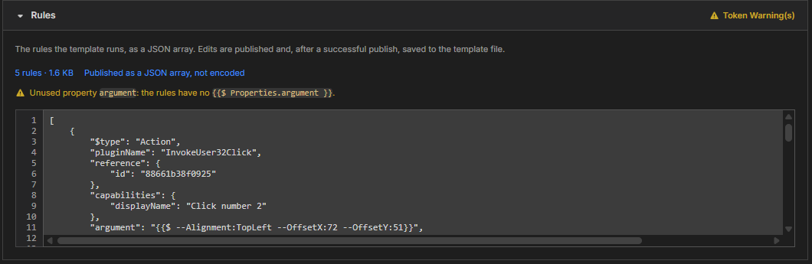

# Module 4: Understand the rules

[⬅ Back to overview](README.md) · [⬅ Module 3](03-properties-and-parameters.md)

⏱️ **About 4 minutes**

The **Rules** section is the heart of the template: it holds the steps that run when someone calls it. G4 fills it in from the job you picked. In this module you'll read it, use tokens to connect it to your properties and parameters, and learn what G4 cleans up when you publish.

In this module, you will:

- Read the Rules section
- Connect rules to properties and parameters with **tokens**
- Understand the warnings
- Know what G4 removes before publishing

---

## Step 1: Open the Rules section

Scroll to **Rules**. It starts open.



The blue line shows the size: **5 rules · 1.6 KB**, and **Published as a JSON array, not encoded**. Below it, the rules appear as **JSON** — plain text made of names and values in curly braces. You can scroll and edit it.

Each rule needs at least two things: a **`$type`** (what kind of step it is, such as `Action`) and a **`pluginName`** (which action it runs). The form tells you if one is missing.

---

## Step 2: Connect the rules to your properties and parameters

You make a property or parameter **do something** by writing a **token** in the rules, where the value belongs:

```text
{{$ Properties.argument }}
{{$ Parameters.SearchText }}
```

Rules for a token:

- Start with `{{$` and end with `}}`
- Leave **one space** after `{{$` and one before `}}`
- Write `Properties.` or `Parameters.` followed by the exact name from its card

Capital letters do not matter — `{{$ properties.ARGUMENT }}` is understood — but copying the card's spelling keeps things tidy.

For example, if your **argument** property should supply the text to type, change a rule's `argument` line from a fixed value to the token. Now whoever calls the template decides the value.

---

## Step 3: Read the warnings

Look at the picture: **Token Warning(s)** on the section header and **Unused property argument: the rules have no {{$ Properties.argument }}** below it. G4 checks the rules against your cards:

| Warning | What it means | How to fix it |
| --- | --- | --- |
| **Unused property** or **Unused parameter** | You created a card that no rule uses | Use its token in a rule, or delete the card |
| **Unknown property** or **Unknown parameter** | A token names something that has no card | Add the card, or fix the spelling |
| **Broken token** | Text that looks like a token but is written wrongly | Fix the braces and spaces |

For an unknown **property**, the message also helps: it either says **Add it in Properties** (the name is one of the six, but has no card) or lists the six allowed names.

> **💡 Tip:** Press an **Unknown** or **Broken token** line to jump to that spot in the rules, selected for you. Unused warnings have no spot to jump to.

---

## Step 4: Know what G4 cleans up when you publish

Bots keep some information that a template should not carry. When you press **Publish**, G4 tidies the rules for you:

- It removes each rule's **`reference`** — the internal identity the rule had inside your bot.
- It removes every **empty value** — fields that are empty text, empty lists, empty groups, or `null`.
- It **keeps** the values `false` and `0`, because they mean something.

The number of rules does not change. After a successful publish, the Rules box shows the cleaned-up version, so what you see is what was published — and what is saved in the template file.

> **⚠️ Important:** A template must not call **itself**. If one of the rules uses your template's own key as its `pluginName`, the Hub rejects the template.

---

## ✔ Check your work

- [ ] You can see the size line (for example **5 rules**) in the Rules section
- [ ] You know what a token looks like and where it goes
- [ ] You know that G4 removes `reference` and empty values when you publish

---

**Next up** 👉 [Module 5: Add an example](05-add-an-example.md)
