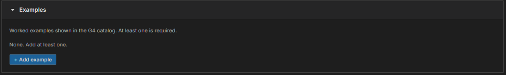
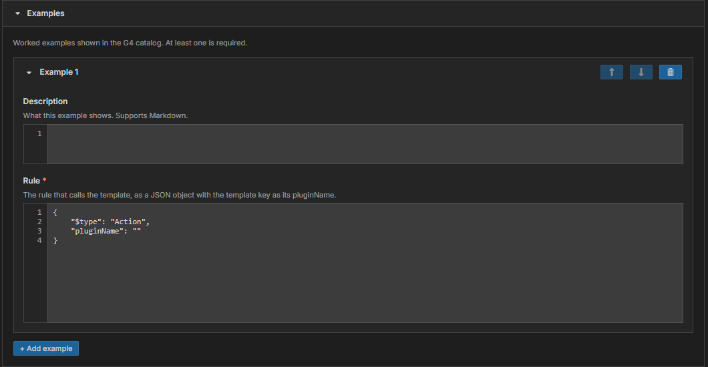

# Module 5: Add an example

[⬅ Back to overview](README.md) · [⬅ Module 4](04-understand-the-rules.md)

⏱️ **About 3 minutes**

Every template needs **at least one example**. An example shows, in the catalog, how a bot calls your template — a bit like the sample sentence in a dictionary. G4 will not publish without one.

In this module, you will:

- See what happens with no examples
- Add an example
- Write the rule that calls your template

---

## Step 1: Start with an empty Examples section

Scroll to the **Examples** section. It starts with no examples and says **None. Add at least one.**



If you press **Publish** now, the form stops you with the message **Add at least one example.**

---

## Step 2: Add an example

Press **+ Add example**. A card opens with two boxes.



- **Description** *(optional)* — what this example shows, in a sentence. Supports Markdown.
- **Rule** *(required)* — the rule that **calls your template**.

---

## Step 3: Write the rule

The **Rule** box starts like this:

```json
{
    "$type": "Action",
    "pluginName": ""
}
```

Type your template's **key** between the quotation marks of `pluginName`. If your key is `SearchBing`, the rule becomes:

```json
{
    "$type": "Action",
    "pluginName": "SearchBing"
}
```

That is a complete example: it says "run the SearchBing template".

If your template has properties or parameters, add them to the rule so the example shows real values. For instance, a template with an **argument** property can be called like this:

```json
{
    "$type": "Action",
    "pluginName": "SearchBing",
    "argument": "G4 automation"
}
```

> **⚠️ Important:** The rule must be valid JSON and needs a **`pluginName`**. If the box is empty, or the `pluginName` is blank, the form marks the box in red: **The rule needs a "pluginName".**
>
> **💡 Tip:** Add more than one example when the template can be called in different ways. Use the arrow buttons on a card to reorder examples, and the trash-can button to delete one.

---

## ✔ Check your work

- [ ] There is at least one example card
- [ ] The example rule has a `pluginName` — your template's key
- [ ] No red message appears under the **Rule** box

---

**Next up** 👉 [Module 6: Publish your template](06-publish-your-template.md)
