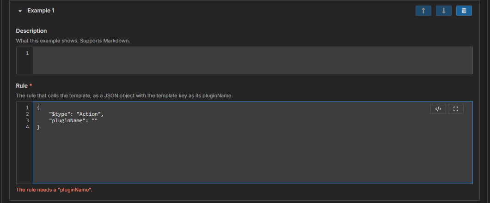

# Module 6: Publish your template

[⬅ Back to overview](README.md) · [⬅ Module 5](05-add-an-example.md)

⏱️ **About 4 minutes**

Everything is filled in. Time to press **Publish**. In this module you'll see what the form checks, how G4 handles warnings, and what you get at the end.

In this module, you will:

- Fix anything the form flags
- Answer the warning question
- Understand what is published and saved

---

## Step 1: Press Publish

Press **Publish** at the bottom of the page. The button changes to **Publishing…** while G4 works. Before anything is sent, the form checks itself.

---

## Step 2: Fix what the form flags

If something is missing or wrong, nothing is sent. A red banner appears at the top — **Fix N field(s) before publishing.** — the form opens the section with the problem, and the box is marked in red with a short reason.



Fix the marked box and press **Publish** again. The most common causes are:

- A required box is empty: **Key**, **File Name**, **Summary**, **Description**, **Categories**, or **Platforms**
- **Rules** is empty or not valid JSON, or a rule has no `$type` or `pluginName`
- There is no **example**, or an example's rule has no `pluginName`
- A **property** has a name that is not one of the six, or is repeated

---

## Step 3: Answer the warning question

If the form has token warnings (see [Module 4](04-understand-the-rules.md)), VS Code asks one question in the bottom-right corner:

```text
Template 'G4.System/SearchBing' has token warnings. Publish anyway?
```

- **Publish Anyway** — continue and send the template.
- **Cancel** — stop this publish. Nothing is sent, and you can fix the warnings first.

> **📝 Note:** The question disappears after a few seconds. If you missed it, click the **bell** icon at the bottom-right of VS Code to bring it back, then choose.

---

## Step 4: See what happens next

When you choose to go ahead, G4 does three things in order:

1. It cleans the rules (removes each `reference` and every empty value — see [Module 4](04-understand-the-rules.md)).
2. It sends the template to the Hub.
3. When the Hub accepts it, it **saves the template as a file** in your project's `templates` folder, under the **File Name** you chose.

A message at the top of the page tells you the result:

- **Success** — **Published G4.System/YourKey.** and a note about the saved file. The Rules box now shows the cleaned-up rules.
- **Failure** — the message names the problem. A rule that calls the template itself, a key already used in another namespace, or a clash between aliases are examples. The matching box is marked in red. Fix it and publish again.

After a successful publish, the page works as the editor for that **template file**: you can keep editing and publish again, and the same key overwrites the earlier version.

> **⚠️ Important:** Publishing changes something outside your computer. Check the **Will publish as** line in [Module 2](02-name-save-and-describe.md) one last time — it shows exactly which template you are creating or overwriting.

---

## Step 5: Find your template file

In the **Explorer**, open the **`templates`** folder. Your template is there as a `.json` file. To update it later, right-click the file and choose **Open in Template Publisher**; change what you need and press **Publish**.

> **💡 Tip:** **Reset to Defaults** restores every box to how it was when the page opened — after a successful publish, that means the template you just published.

---

## ✔ Check your work

- [ ] You pressed **Publish** and the form either published or told you which box to fix
- [ ] You know how to answer **Publish Anyway** and **Cancel**
- [ ] You can find your template file in the `templates` folder

---

**You did it** 🎉 Your steps are now a reusable template. Bots can call it by its key.
