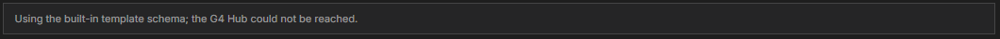

# Troubleshooting: Publish a Template

[⬅ Back to overview](README.md)

Find your symptom below. Each entry says what you see, why it happens, and what to do.

---

## "Open in Template Publisher" is missing from the right-click menu

- **Symptom:** You right-click a file and the menu has no **Open in Template Publisher**.
- **Cause:** The entry appears only for `.json` files inside the project's **`bots`** folder or **`templates`** folder. It does not appear for other file types, for folders, for files at the top level of the project (such as `manifest.json`), or for the starter files in **`base.bots`**.
- **Fix:** Put the bot in the `bots` folder, or open a template file from the `templates` folder. See [Module 1](01-open-the-template-publisher.md).

---

## Nothing happens after I pick Open in Template Publisher

- **Symptom:** A list appears at the top of VS Code, or nothing seems to open.
- **Cause:** Your bot has more than one stage or job, so VS Code asks which one to use. If you press **Esc**, the publisher does not open.
- **Fix:** Pick a stage, then a job, from the list. Each choice looks like `#2 · Name`. See [Module 1](01-open-the-template-publisher.md).

---

## A grey note says "Using the built-in template schema; the G4 Hub could not be reached"

- **Symptom:** A grey box at the top of the page reads **Using the built-in template schema; the G4 Hub could not be reached.**

  

- **Cause:** When the page opens, G4 asks the Hub what a template looks like. The Hub did not answer, so the page used its own built-in copy.
- **Fix:** You can keep going — the form works the same. Publishing, however, needs the Hub. If **Publish** fails, check that the G4 engine is running (the status bar says **G4 Engine is Connected and Ready**) and open the page again.

---

## "Fix N fields before publishing"

- **Symptom:** A red banner at the top, and red messages under some boxes.
- **Cause:** A required box is empty, or a value broke a rule. Typical ones: no example, an example rule without a `pluginName`, an empty **File Name**, rules that are not valid JSON.
- **Fix:** Fix each marked box. See [Module 6](06-publish-your-template.md).

---

## "Use one of: argument, onElement…" or "Duplicate of property 1"

- **Symptom:** A property card shows a red message and a **Name** box.
- **Cause:** The stored template has a property name that is not one of the six allowed names, or uses the same name twice.
- **Fix:** Change the name in the box to one of the six (`argument`, `onElement`, `onAttribute`, `locator`, `locatorType`, `regularExpression`), or delete the card. See [Module 3](03-properties-and-parameters.md).

---

## Yellow warnings: "Unused Property" or "Token Warning(s)"

- **Symptom:** Yellow triangles on **Properties**, **Parameters**, a card, or **Rules**.
- **Cause:** A card is not used by any rule, a token names something that does not exist, or a token is written incorrectly.
- **Fix:** Follow the table in [Module 4](04-understand-the-rules.md). Warnings never block publishing, so you can also choose **Publish Anyway**.

---

## "Could not reach the G4 Hub"

- **Symptom:** The result message starts with **Could not reach the G4 Hub**, followed by a short reason such as **ECONNREFUSED** or **timed out**.
- **Cause:** The Hub did not answer: it is not running, or the address in `manifest.json` is wrong.
- **Fix:** Check that the G4 engine is running (the status bar should say **G4 Engine is Connected and Ready**) and that the **Connection** settings point to it, then press **Publish** again.

---

## "…has unsaved changes that could not be saved, so the template was not published"

- **Symptom:** The result message is red, and nothing was published.
- **Cause:** The template file is open in another tab with unsaved edits. G4 saves that tab before publishing, and this time VS Code could not save it — for example, the file is read-only.
- **Fix:** Switch to the file's tab and save it yourself (or close it without saving), then press **Publish** again.

---

## The Hub rejected the template

- **Symptom:** The result message names a problem and a box is marked in red.
- **Cause:** The Hub checked the template and refused it. Common reasons:
  - A rule inside the template calls the template **itself** (its own key as `pluginName`).
  - The **key** already exists under a **different namespace** — the Hub identifies a template by key alone.
  - An **alias** is already used by another template.
- **Fix:** Change the marked box (the rules, the key, or the aliases) and publish again.

---

## The template was published but no file appeared in `templates`

- **Symptom:** The page says **Published**, but the **`templates`** folder has no new file.
- **Cause:** G4 saves the file after publishing. If there is no workspace folder open, or the file cannot be written, the message adds a note about it.
- **Fix:** Open your project as a **folder** in VS Code (**File**, then **Open Folder**), read the note in the result message, and publish again. The template in the Hub is already updated.

---

**Still stuck?** Open the **Output** panel in VS Code (**View**, then **Output**) and choose **G4 Extension** (or **G4 Hub**) from the drop-down. These logs record each publish attempt and the reason it failed.
