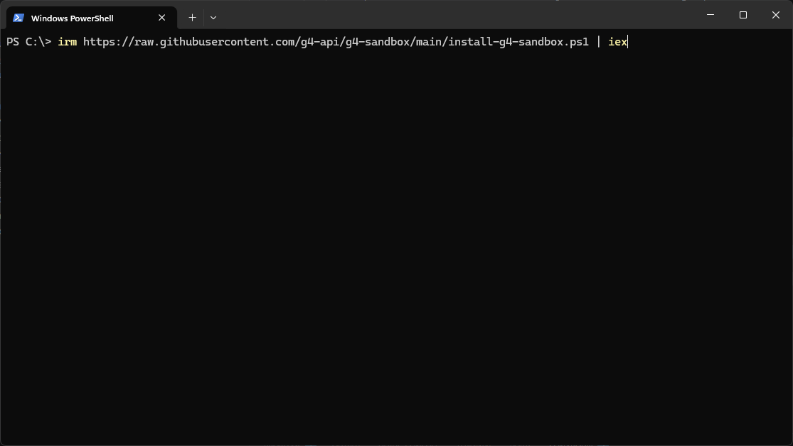

# Module 1: Deploy the sandbox

[⬅ Back to overview](README.md)

⏱️ **About 10 minutes** (most of it is download time)

In this module, you will:

- Understand what the "sandbox" is
- Run a single command that installs everything
- Find your sandbox folder once it's ready

---

## What is the sandbox, in plain words?

The **sandbox** is a self-contained folder that holds everything G4 needs to run — the engine, the recorders, the browser drivers, and even its own copy of VS Code. Nothing gets installed system-wide and nothing to configure by hand. Think of it as a fully packed toolbox: you download it once, then open it and start working.

---

## Step 1: Run the install command

Open a terminal and run the command for your operating system. The installer downloads the latest sandbox and unpacks it for you.

**On Windows** — open **PowerShell** and run:

```powershell
irm https://raw.githubusercontent.com/g4-api/g4-sandbox/main/install-g4-sandbox.ps1 | iex
```

**On Linux** — open a terminal and run:

```bash
curl -fsSL https://raw.githubusercontent.com/g4-api/g4-sandbox/main/install-g4-sandbox.sh | bash
```

> **💡 Tip:** This step downloads a large package. Depending on your connection it can take several minutes — that's normal. Let it finish without closing the window.



---

## Step 2: Find your sandbox folder

When the installer finishes, your sandbox lives in a versioned folder. On **Windows** it's usually one of these:

```text
C:\g4-sandbox\g4-sandbox-v2026.06.24.71
```

or, depending on the installer version, directly under the drive root:

```text
C:\g4-sandbox-v2026.06.24.71
```

> **📝 Note (Linux):** On Linux the same folder lives under `/opt` instead of `C:\` — for example `/opt/g4-sandbox/g4-sandbox-v2026.06.24.71`.
>
> **💡 Tip:** The numbers at the end are just the version. Yours will likely be different — that's fine. Throughout this guide, wherever you see `g4-sandbox-v2026.06.24.71`, use *your* version folder instead.


---

## ✔ Check your work

Before moving on, make sure:

- [ ] The install command finished without errors
- [ ] You can open the sandbox folder (`C:\g4-sandbox\g4-sandbox-v...` on Windows, `/opt/g4-sandbox/...` on Linux)
- [ ] Inside, you can see several folders and a few files whose names start with `start-`

---

**Next up** 👉 [Module 2: Start VS Code](02-start-vscode.md)
