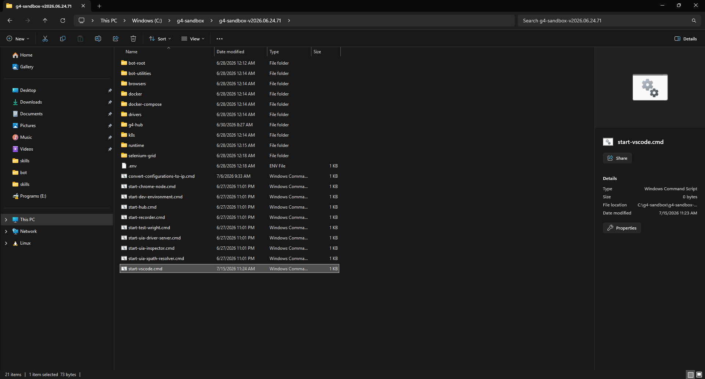

# Module 2: Start VS Code

[⬅ Back to overview](README.md) · [⬅ Module 1](01-deploy-the-sandbox.md)

⏱️ **About 3 minutes**

For everyday work you don't need to launch the whole G4 stack — you just **start VS Code**. The G4 extension, together with the sandbox you'll attach to your project, brings up the engine and recorders **on demand**. This is the light, recommended way to work.

In this module, you will:

- Start VS Code from the sandbox
- Understand what runs now versus what starts automatically later

---

## Step 1: Run start-vscode.cmd

Open your sandbox folder from [Module 1](01-deploy-the-sandbox.md) and start **just VS Code**:

- **On Windows:** double-click **`start-vscode.cmd`**
- **On Linux:** open a terminal in the sandbox folder and run `./start-vscode.sh`

VS Code opens, already pointed at your sandbox.

> **💡 Tip:** This is all you need for this guide. You do **not** have to run `start-dev-environment.cmd` — that launches the entire stack (recorders, engine, browser services) at once, which you rarely need. See the advanced [Module 9](09-start-full-environment.md) for when you would.

---

## Step 2: What happens from here

VS Code is open, but the G4 tools aren't wired up **yet** — that's the next two modules:

- **[Module 3](03-install-the-g4-extension.md)** installs the G4 extension (a one-time step).
- **[Module 4](04-create-your-first-project.md)** creates a project and attaches it to your sandbox.

Once a **sandbox-attached project** is open, the extension **starts the engine from that sandbox automatically** and the status bar reaches **`G4 Engine is Connected and Ready`** — no `start-hub.cmd`, no full environment required.

> **📝 Note:** Because the engine starts on demand, you won't see it connect until after Module 4. That's expected — there's nothing to connect to until you have a sandbox-attached project open.

---

## ✔ Check your work

- [ ] You started VS Code with **`start-vscode.cmd`** (not the full environment)
- [ ] VS Code opened, pointed at your sandbox
- [ ] You understand the engine and recorders start **on demand** later — you don't launch them by hand

---

**Next up** 👉 [Module 3: Install the G4 extension](03-install-the-g4-extension.md)
