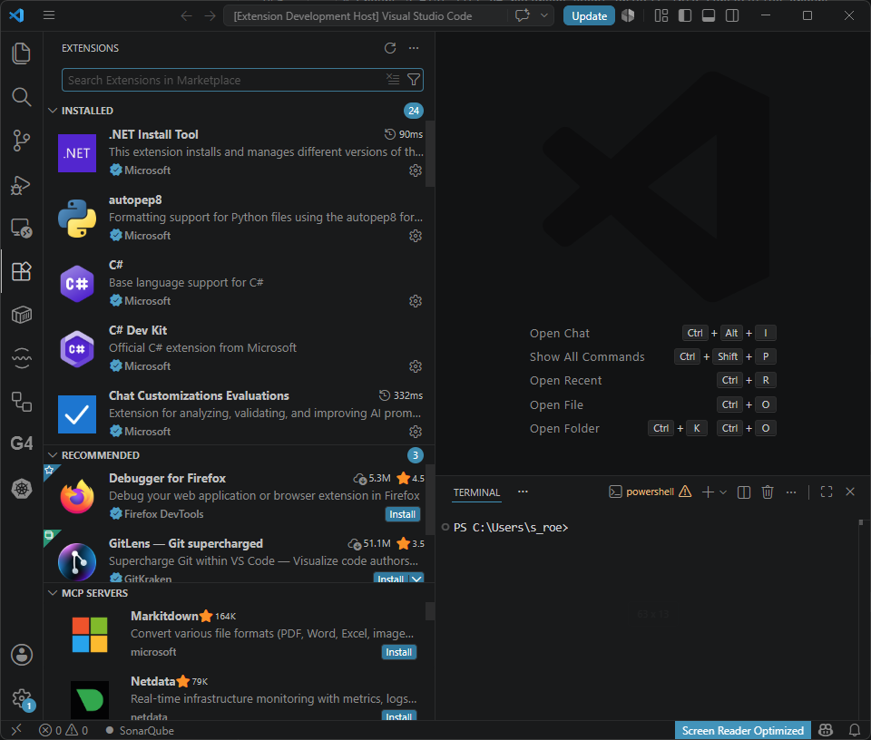
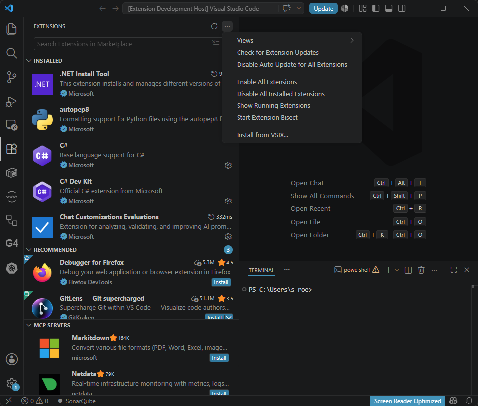
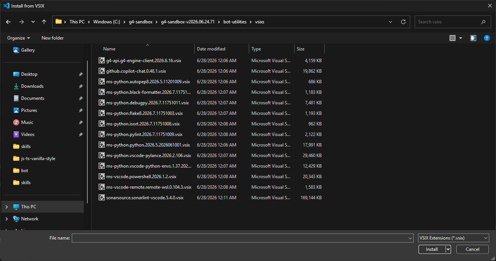
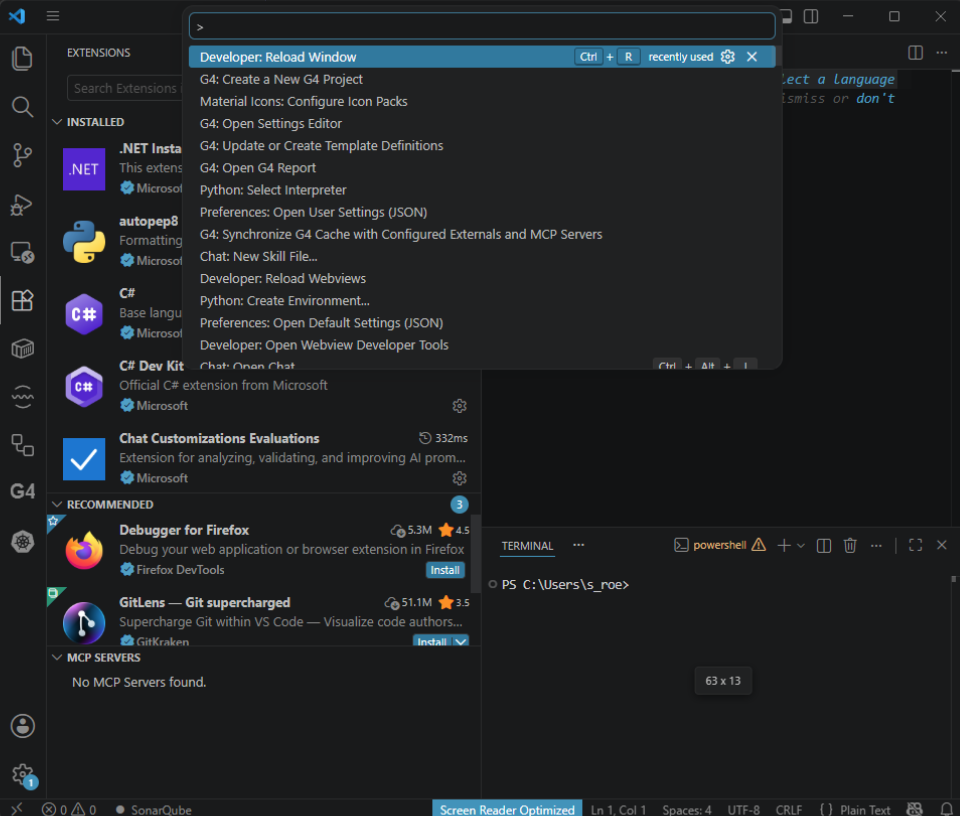
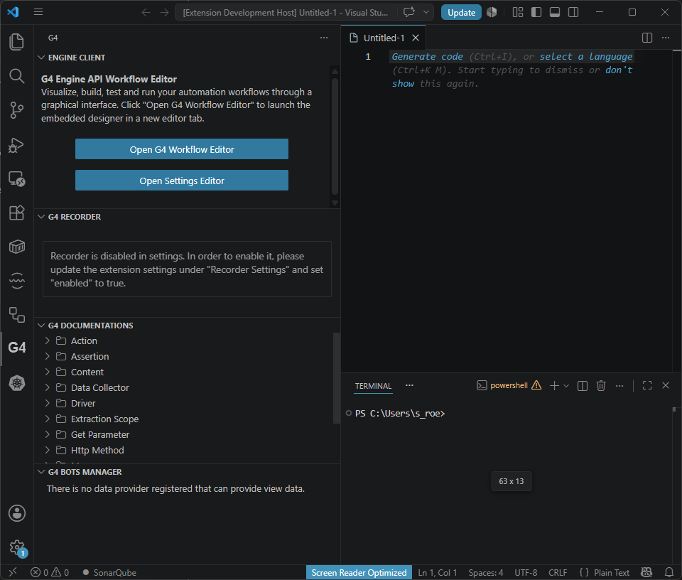

# Module 3: Install the G4 extension

[⬅ Back to overview](README.md) · [⬅ Module 2](02-start-vscode.md)

⏱️ **About 5 minutes** · **One-time setup**

The G4 tools live inside VS Code as an **extension**. You install it once per machine. After this module you'll see the **G4 icon** in VS Code and never have to do this again.

In this module, you will:

- Install the G4 extension from the bundled `.vsix` file
- Reload VS Code so the extension activates
- Confirm the G4 icon appears

---

## Step 1: Open the Extensions view

In VS Code, click the **Extensions** icon in the **Activity Bar** on the far left (it looks like four small squares).



---

## Step 2: Choose "Install from VSIX…"

At the top of the Extensions panel, click the **`...`** (More Actions) button, then choose **Install from VSIX…**



---

## Step 3: Pick the G4 extension file

A file picker opens. Navigate into your sandbox folder to:

```text
<sandbox>\bot-utilities\vsixs\
```

Select the file that starts with **`g4-api.g4-engine-client`** — for example:

```text
g4-api.g4-engine-client.2026.6.16.vsix
```

> **💡 Tip:** The version number in the file name may be different on your machine — just pick the `g4-api.g4-engine-client` file that's there.
>
> **📝 Note (Linux):** The same file lives under `<sandbox>/bot-utilities/vsixs/` — for example `/opt/g4-sandbox/g4-sandbox-v.../bot-utilities/vsixs/`.



Click **Install**. VS Code installs the extension in the background.

---

## Step 4: Reload the window

For the extension to fully activate, reload VS Code:

1. Press **`Ctrl` + `Shift` + `P`** to open the **Command Palette**.
2. Type **`reload window`**.
3. Select **Developer: Reload Window**.



VS Code reloads. This only takes a moment.

---

## Step 5: Confirm the G4 icon appeared

After the reload, look at the **Activity Bar** on the left. You'll now see a new **G4 icon** among the others. That's the extension, up and running.



---

## ✔ Check your work

- [ ] The extension installed without an error notification
- [ ] You ran **Developer: Reload Window**
- [ ] A **G4 icon** is now visible in the Activity Bar on the left

---

**Next up** 👉 [Module 4: Create your first project](04-create-your-first-project.md)
