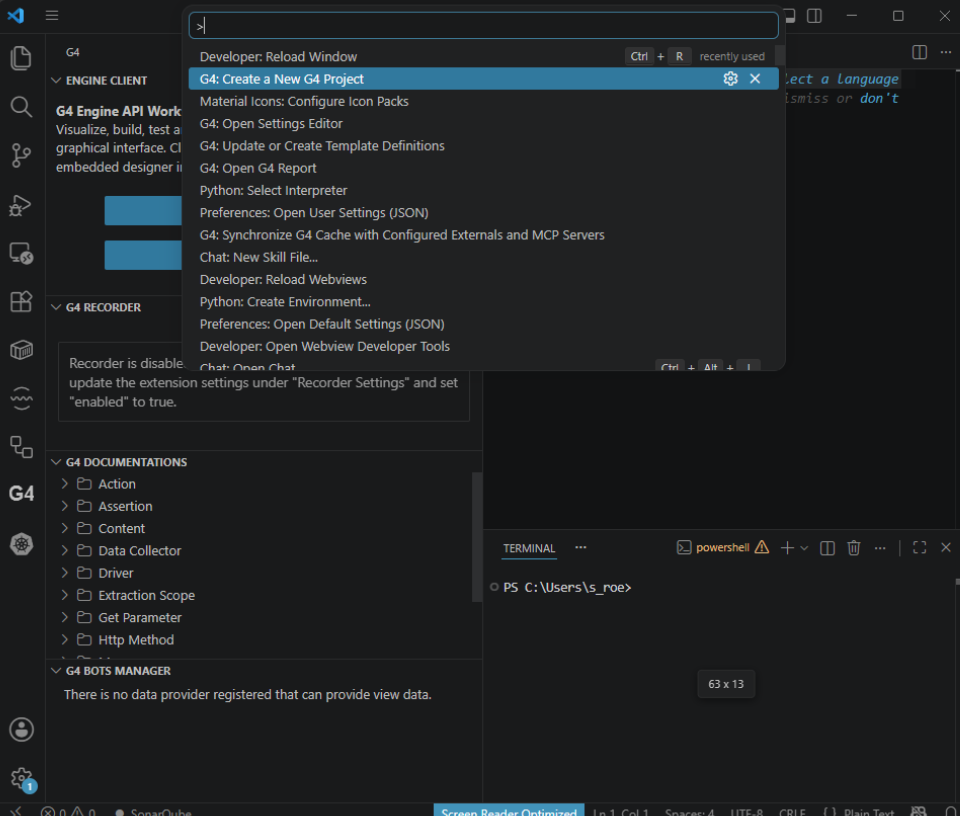
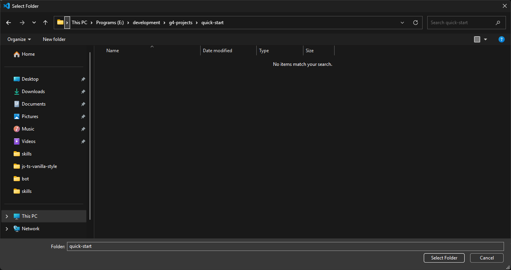
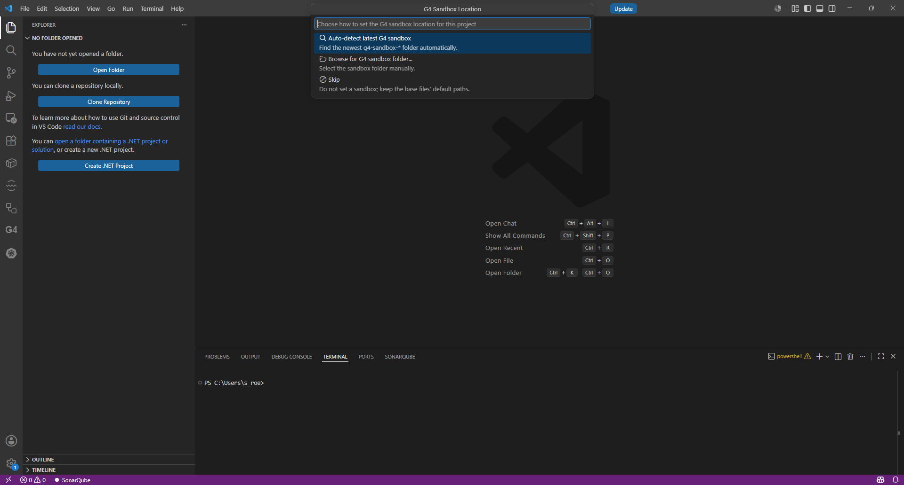
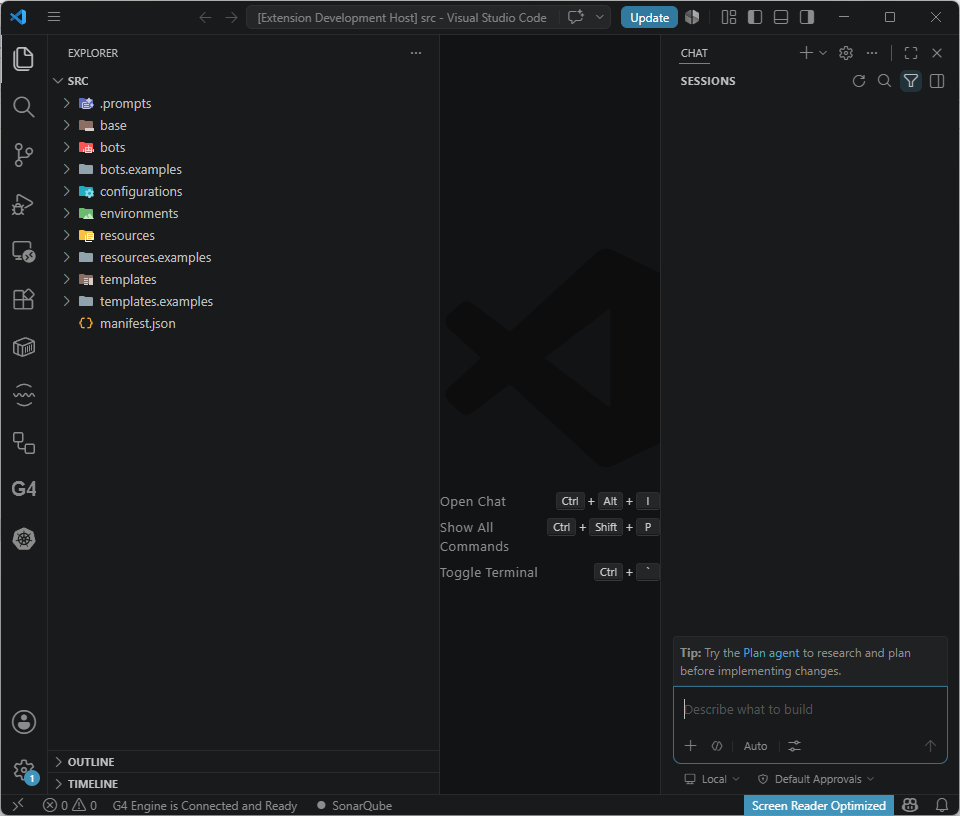
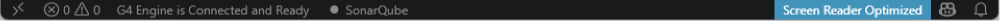

# Module 4: Create your first project

[⬅ Back to overview](README.md) · [⬅ Module 3](03-install-the-g4-extension.md)

⏱️ **About 6 minutes**

A **G4 project** is the home for your automation work — it holds your workflow definitions and settings. In this module you'll create one, **attach it to your sandbox**, and confirm the engine is connected.

In this module, you will:

- Create a new G4 project into an empty folder
- Understand the "empty folder" rule (it trips up newcomers)
- Choose which **sandbox** the project uses
- Confirm the status bar says **G4 Engine is Connected and Ready**

> **💡 Why the sandbox matters:** The sandbox you attach here is what supplies your project's **engine (hub) connection**, its **browser and driver paths**, the recorder's **Use Sandbox** shortcut, and pins it to a **specific sandbox version**. Getting this right now means automations and recorders "just work" later. (You can change it anytime — see [Module 11](11-change-your-sandbox.md).)

---

## Step 1: Make an empty folder first

The create-project command fills the folder you choose — **it does not create a container folder for you**. So make one yourself first.

- Create a **new, empty folder** somewhere sensible, e.g. `C:\Work\my-first-g4`.

> **⚠️ Important:** Point the project at a **dedicated empty folder**. Do **not** use your **Desktop** or a **drive root** (like `C:\`) — the command would scatter project files across that location.

---

## Step 2: Run the create-project command

In VS Code:

1. Press **`Ctrl` + `Shift` + `P`** to open the Command Palette.
2. Type **`new g4 project`**.
3. Select **G4: Create a New G4 Project**.

---

## Step 3: Choose your empty folder

A folder picker opens. Select the **empty folder** you made in Step 1, then confirm.

---

## Step 4: Choose the sandbox location

Next, a **G4 Sandbox Location** picker appears — *"Choose how to set the G4 sandbox location for this project."* This is where you attach the project to a sandbox. You get three choices:

| Option | What it does | When to pick it |
| --- | --- | --- |
| **Auto-detect latest G4 sandbox** | Finds the **newest** `g4-sandbox-*` folder automatically. On Windows it scans each drive root (`C:\g4-sandbox\…`, `D:\…`, `E:\…`); on Linux it scans `/opt/g4-sandbox/…`. | **Recommended** — the easy path when your sandbox is in a standard location. |
| **Browse for G4 sandbox folder…** | Lets you **manually select** the sandbox folder yourself. | When your sandbox is in a custom location auto-detect won't find. |
| **Skip** | Does **not** attach a sandbox — the base files keep their default paths. | Advanced; only if you'll wire paths/connection yourself later. |

For this guide, choose **Auto-detect latest G4 sandbox**.

> **📝 Note:** Picked **Skip** by accident, or need to point at a different sandbox later? You can add or change the sandbox anytime from the Settings Editor — see [Module 11](11-change-your-sandbox.md).

After you choose, G4 creates the project structure inside your folder — including a `manifest.json` and a couple of base folders you'll use later.

---

## Step 5: Confirm the engine is connected

Look at the **status bar** along the bottom edge of VS Code. After a short moment it should say:

> **`G4 Engine is Connected and Ready`**

This means VS Code found the running engine (the **G4 Hub** window from Module 2) and you're ready to build.

> **📝 Note:** If the status bar stays on *"Waiting for G4 Engine…"* or shows a connection error, don't worry — see the [Troubleshooting](troubleshooting.md#g4-engine-wont-connect) page for quick fixes.

---

## ✔ Check your work

- [ ] You created the project inside a **dedicated empty folder**
- [ ] You chose a **sandbox** (Auto-detect) when prompted
- [ ] The Explorer shows the new project files (including `manifest.json`)
- [ ] The status bar says **G4 Engine is Connected and Ready**

---

**Next up** 👉 [Module 5: Get your G4 token](05-get-your-g4-token.md)
