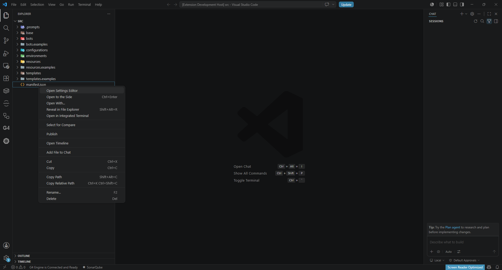
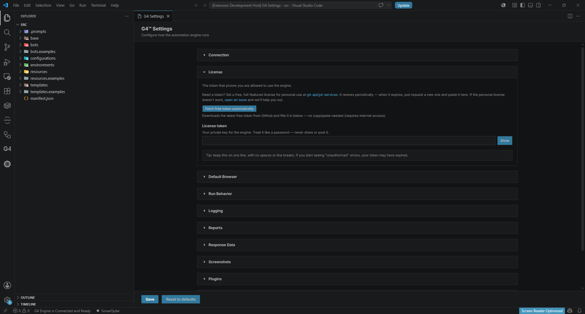
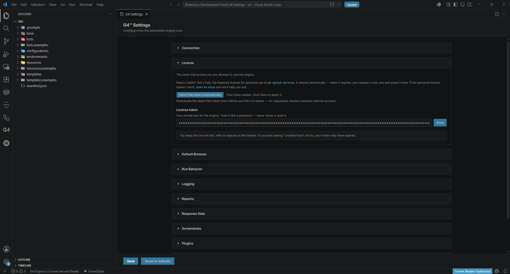

# Module 5: Get your G4 token

[⬅ Back to overview](README.md) · [⬅ Module 4](04-create-your-first-project.md)

⏱️ **About 3 minutes**

Every automation you run needs a **G4 token** — think of it as your key to the engine. The good news: you can fetch a **free token** in a couple of clicks, right from the Settings Editor.

In this module, you will:

- Open the project's Settings Editor
- Fetch a free token automatically
- Save it so your project can use it

---

## Step 1: Open the Settings Editor

In the **Explorer**, **right-click `manifest.json`** and choose **Open Settings Editor**.

> **💡 Tip:** You can also open it from the **G4 view** in the Activity Bar — click the **Open Settings Editor** button there.

---

## Step 2: Fetch a free token

In the Settings Editor, find the **License** section. Click **Fetch free token automatically**.

G4 downloads a free token from GitHub and fills the **License token** field for you — no copy/paste needed. You'll see a confirmation like **"Free token added. Click Save to apply it."**

---

## Step 3: Save to apply the token

The token is stored hidden (shown as dots) — treat it like a password. Click **Save** (bottom-left of the Settings Editor) to apply it to your project.

> **💡 Tip:** Want to see the actual token value (for example to paste it somewhere else)? Click **Show** to reveal it. You don't need to for the automatic flow.
>
> **📝 Note:** Keep your token private, like a password. If you ever need a new one, just click **Fetch free token automatically** again and Save.

---

## ✔ Check your work

- [ ] The Settings Editor is open for your project
- [ ] The **License** section shows a token value (dots) in the field — not empty
- [ ] You clicked **Save** to apply it

---

**Next up** 👉 [Module 6: Build your first automation](06-build-your-first-automation.md)
