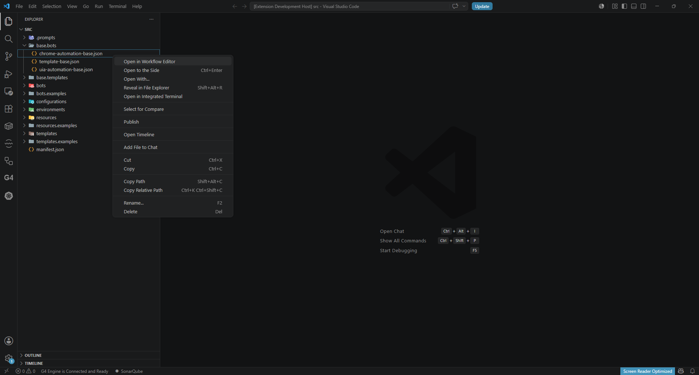
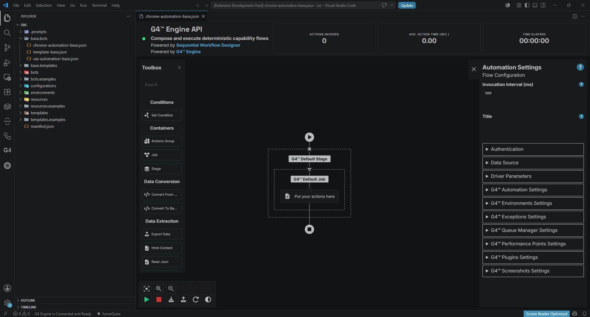
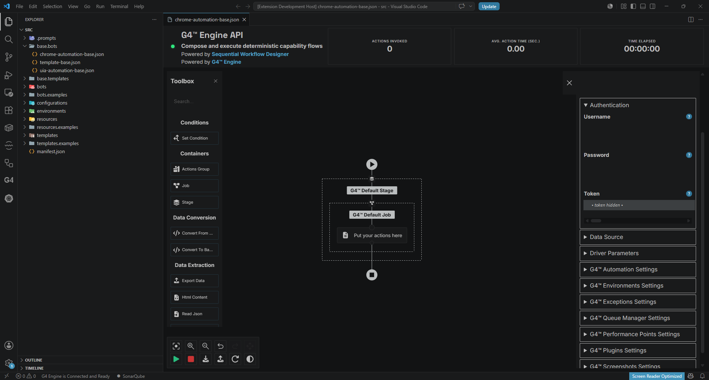
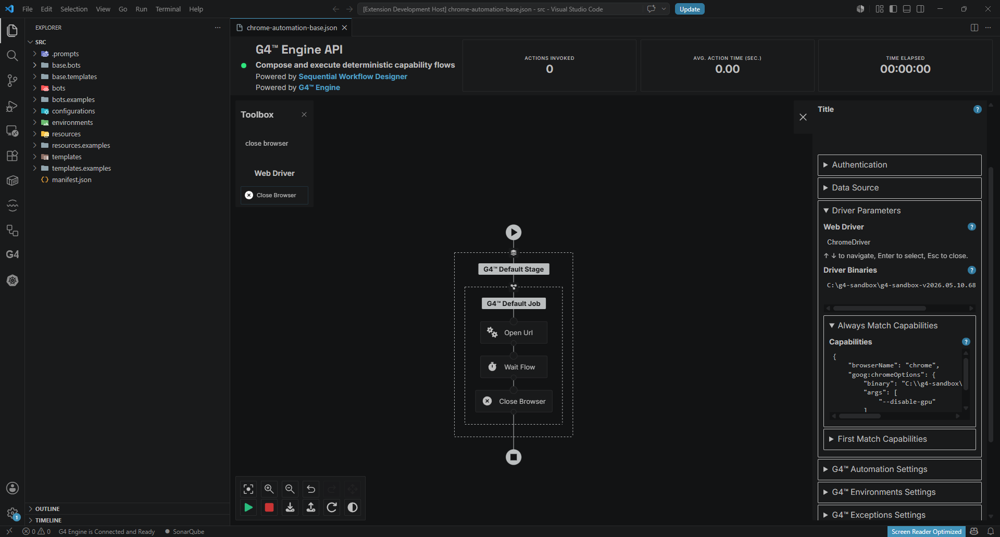
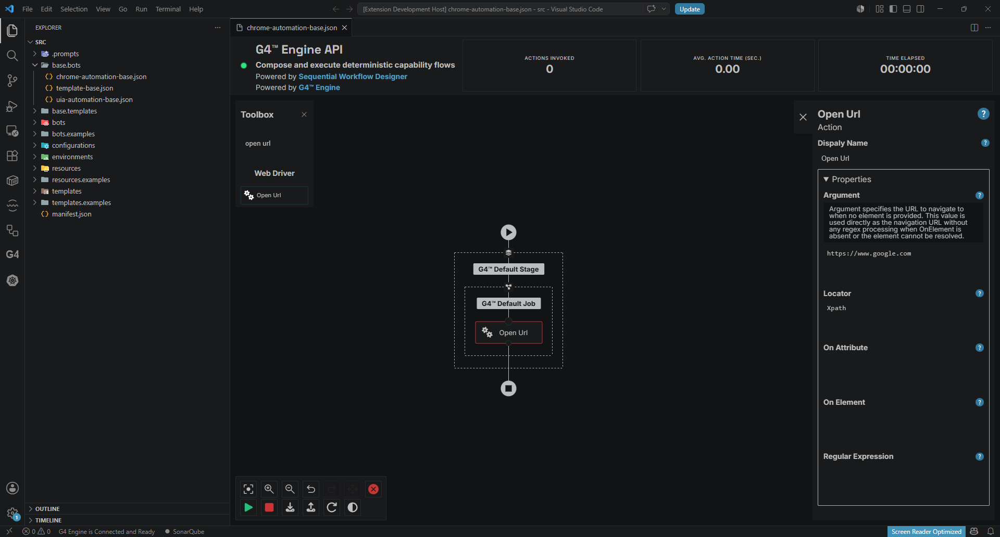
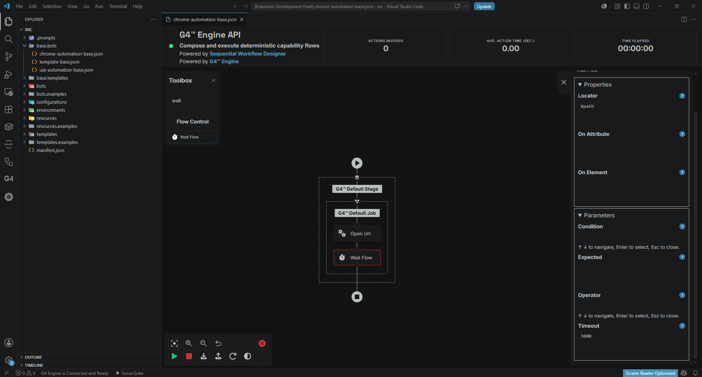
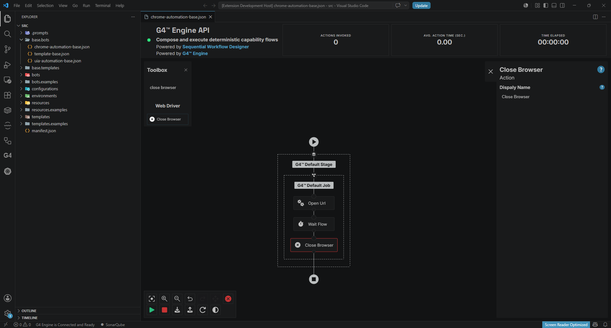
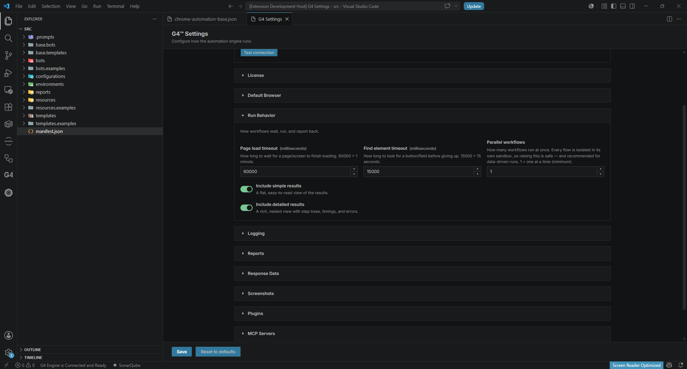
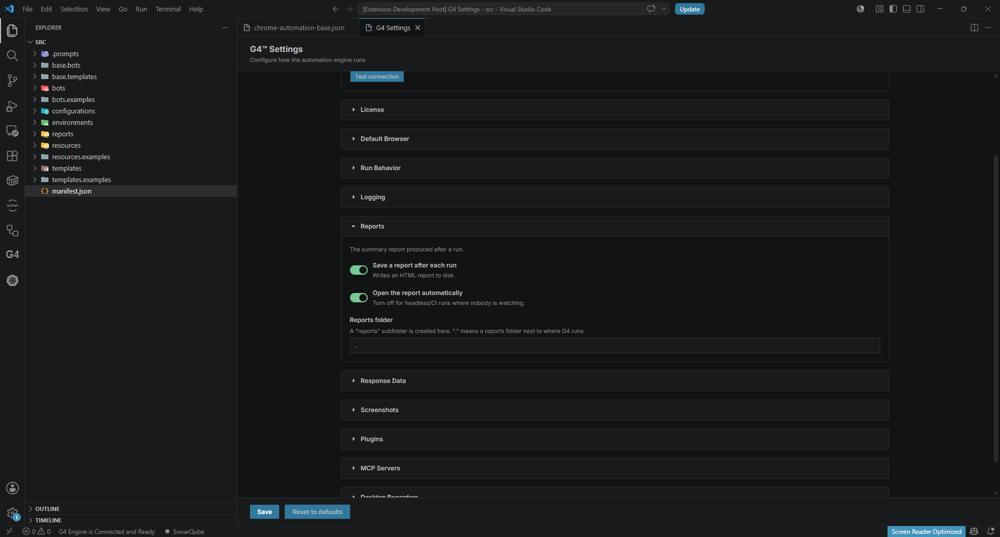
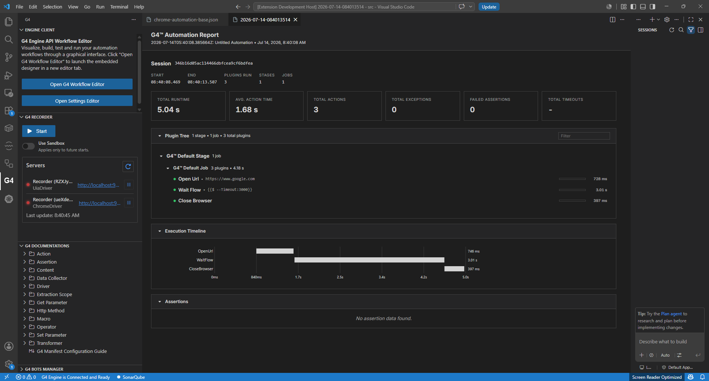

# Module 6: Build your first automation

[⬅ Back to overview](README.md) · [⬅ Module 5](05-get-your-g4-token.md)

⏱️ **About 8 minutes**

Time for the payoff. You'll build a tiny but complete automation — **open a web page, wait a moment, then close the browser** — and watch it run.

You'll build it visually: drag building blocks onto a canvas and set a couple of values. No code.

In this module, you will:

- Open a base workflow in the Workflow Editor
- Make sure your token is set
- Verify the sandbox's Chrome browser and driver settings (auto-filled for you)
- Add three actions: **Open Url → Wait → Close Browser**
- Run it and read the report

---

## Step 1: Open a base in the Workflow Editor

In the Explorer, expand the **`base.bots`** folder. Right-click the base you want to start from — for a browser automation pick **`chrome-automation-base.json`** (there's also `uia-automation-base.json` for desktop apps) — and choose **Open in Workflow Editor**.



The visual **Workflow Editor** opens. On the left is the **Toolbox** of building blocks; in the middle is the **canvas** (with a "Put your actions here" placeholder); the **Play** and **Stop** buttons are at the bottom.



---

## Step 2: Make sure your token is set

Click any **empty spot on the canvas**. The **automation settings** open in the panel on the right. Click **Authentication**, and confirm the **token** field contains your G4 token.

- If you saved a token in [Module 5](05-get-your-g4-token.md), it may already be here.
- If the field is empty, paste your token in.



> **💡 Tip:** No token yet? Go back to [Module 5](05-get-your-g4-token.md) and fetch a free one — it takes two clicks.

---

## Step 3: Verify the browser and driver settings

For the **Chrome** automation to run, the engine needs to know where the sandbox's bundled Chrome and its driver live. Here's the good part: when you attached a sandbox back in [Module 4](04-create-your-first-project.md), G4 **filled these in for you**. So this step is a quick check, not data entry.

In the same **Automation Settings** panel, expand **Driver Parameters** and confirm three things (wherever you see **`<sandbox>`**, it's your versioned sandbox folder, e.g. `C:\g4-sandbox\g4-sandbox-v2026.06.24.71`):

- **Web Driver** is **`ChromeDriver`**.
- **Driver Binaries** points inside your sandbox — `<sandbox>\drivers\chrome`.
- Under **Always Match Capabilities**, the **Capabilities** JSON's `binary` points to your sandbox's `chrome.exe`.



> **💡 Be aware:** On your **first** project these values are almost always correct — you shouldn't need to touch them. But do glance at them: if you moved the sandbox or a path looks wrong, fix it here (the fields **auto-save** — there's no Save button). Double-click a field to open a larger editor box.
>
> **📝 Note (Linux):** Paths use forward slashes under `/opt`, e.g. `/opt/g4-sandbox/g4-sandbox-v.../drivers/chrome`.

---

## Step 4: Add the "Open Url" action

In the **tool box** on the right, type **`open url`** in the search box. Drag the **Open Url** action onto the canvas.

Click the action to open its **parameters** panel, and in the **Argument** field type:

```text
https://www.google.com
```



---

## Step 5: Add the "Wait" action

In the tool box search, type **`wait`**. Drag the **Wait Flow** action onto the canvas, **below** the Open Url action so it runs next.

Click it to open its parameters. Scroll down to the **Timeout** field (it's near the bottom — you may need to scroll the panel) and enter:

```text
3000
```

This waits 3000 milliseconds (3 seconds) so you can see the page before it closes.



---

## Step 6: Add the "Close Browser" action

In the tool box search, type **`close browser`**. Drag the **Close Browser** action onto the canvas, **below** the Wait action.

Your flow now reads, top to bottom: **Open Url → Wait → Close Browser**.



---

## Step 7: Turn on the report

By default, a run won't open a detailed report until you switch it on. This is a one-time setting per project, in the **Settings Editor** (right-click `manifest.json` → **Open Settings Editor**, as in [Module 5](05-get-your-g4-token.md)).

In the **Run Behavior** section, turn on **Include detailed results** (a rich, nested view with step trees, timings, and errors):



Then, in the **Reports** section, turn on both:

- **Save a report after each run** — writes an HTML report to disk.
- **Open the report automatically** — pops the report open when a run finishes.



Click **Save** in the Settings Editor to apply, then return to your workflow tab.

> **💡 Tip:** You only need to do this once per project — the settings stick for future runs.

---

## Step 8: Run it and read the report

Click the green **Play** button. G4 runs your automation: a browser opens Google, waits three seconds, then closes. When it finishes, the **G4 Automation Report** opens automatically as a new tab in VS Code.

The report summarizes the run — total runtime, action count, and any exceptions — and shows a **Plugin Tree** of each action (Open Url → Wait Flow → Close Browser) with its timing, plus an **Execution Timeline**. Green dots mean success.



> **📝 Note:** If the run reports an authentication error, your token may be missing or expired. Revisit [Module 5](05-get-your-g4-token.md), fetch a fresh token, Save, and run again.

---

## ✔ Check your work

- [ ] **Driver Parameters** shows Web Driver `ChromeDriver`, a Driver Binaries path inside your sandbox, and Chrome **Capabilities** (auto-filled — you just confirmed them)
- [ ] Your flow has three actions in order: **Open Url → Wait → Close Browser**
- [ ] Open Url's **Argument** is `https://www.google.com`
- [ ] Wait's **Timeout** is `3000`
- [ ] In Settings: **Include detailed results**, **Save a report after each run**, and **Open the report automatically** are on (and Saved)
- [ ] You clicked **Play** and a **report** opened

---

**Next up** 👉 [Module 7: Verify your recorders](07-verify-your-recorders.md)
