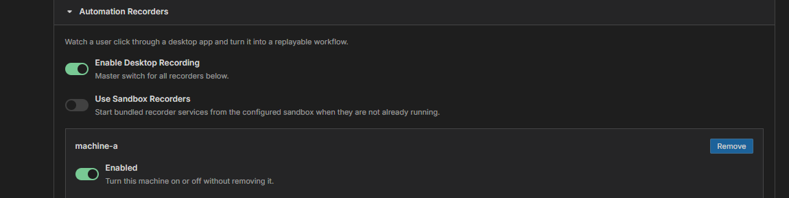
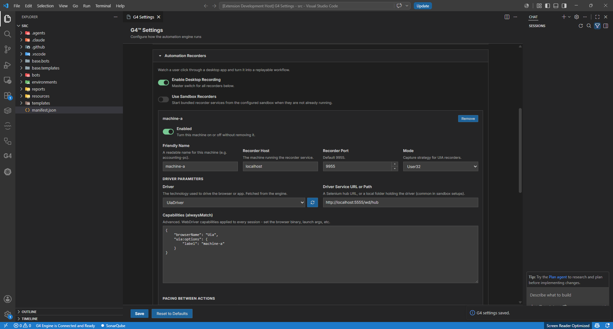
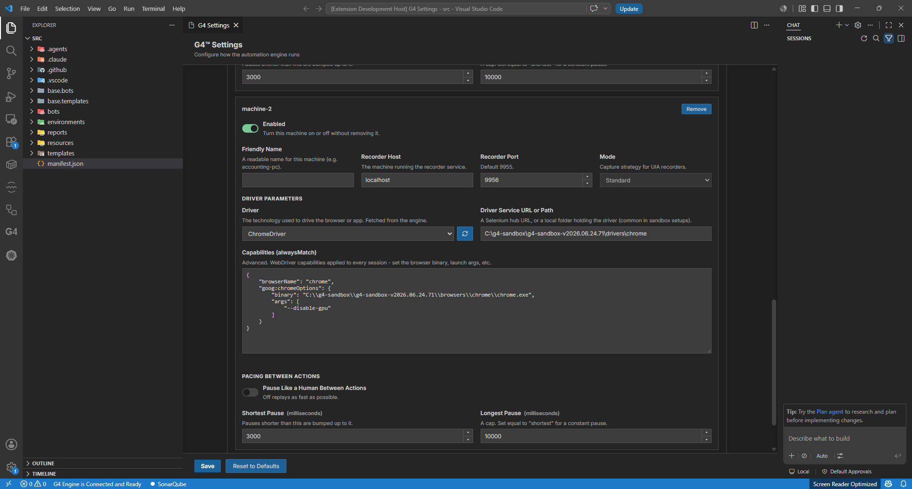

# Module 7: Verify your recorders

[⬅ Back to overview](README.md) · [⬅ Module 6](06-build-your-first-automation.md)

⏱️ **About 3 minutes**

In the next module you'll **record** a workflow instead of building it by hand. The good news: because you attached a sandbox when you created the project, your two recorders are **already configured**. This module is a quick check that they're there and correct — a fresh project needs no setup.

The two recorders:

- **UIA Recorder** — records **desktop** apps (port `9955`).
- **Chromium Recorder** — records the **browser** (port `9956`).

In this module, you will:

- Open the Automation Recorders settings
- Confirm both recorders are present and enabled

---

## Step 1: Open the Automation Recorders settings

Open the **Settings Editor** (right-click `manifest.json` → **Open Settings Editor**) and scroll to the **Automation Recorders** section. Make sure the master switch **Enable Desktop Recording** is **on**.

---

## Step 2: Check the two recorders are there

You should see two machine entries, filled in from your sandbox. Confirm at a glance:

| Recorder | Enabled | Recorder Port | Driver |
| --- | --- | --- | --- |
| **UIA** | On | `9955` | `UiaDriver` |
| **Chromium** | On | `9956` | `ChromeDriver` |

Each already has its **Driver Service URL or Path** and **Capabilities** filled in from the sandbox — you don't type anything.

> **💡 Tip:** On a brand-new project these are correct as-is. If a value looks wrong, or a recorder is missing, see the advanced [Module 10: Configure recorders manually](10-configure-recorders-manually.md).

---

## ✔ Check your work

- [ ] **Enable Desktop Recording** is on
- [ ] A **UIA** recorder is present and enabled on port `9955`
- [ ] A **Chromium** recorder is present and enabled on port `9956`

---

**Next up** 👉 [Module 8: Record your first session](08-record-your-first-session.md)
