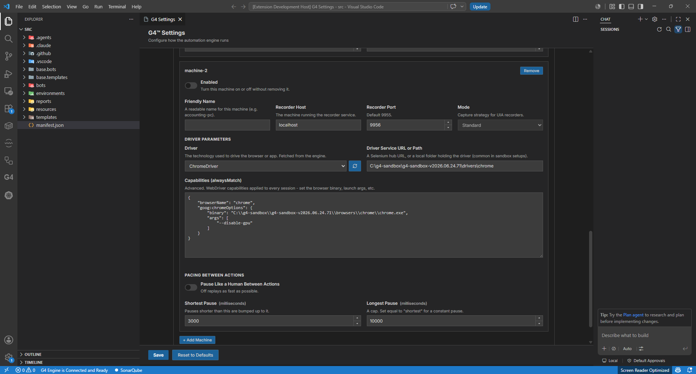
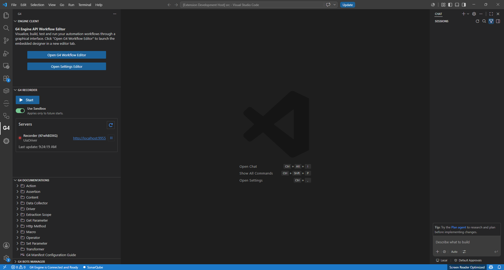
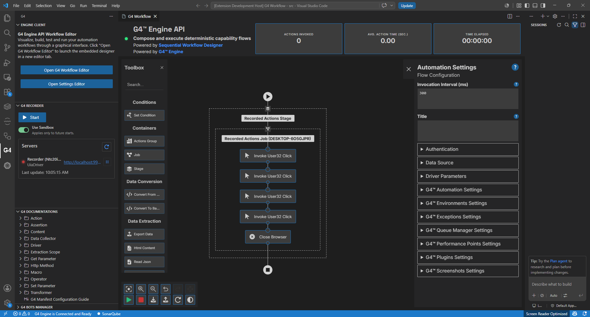
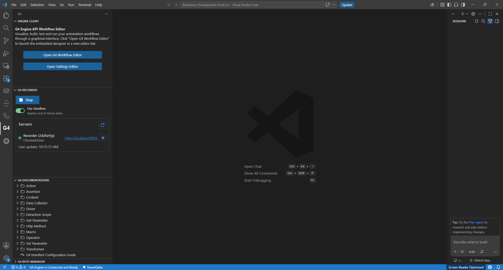
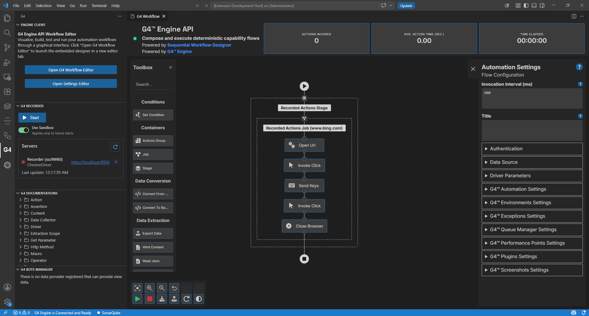

# Module 8: Record your first session

[⬅ Back to overview](README.md) · [⬅ Module 7](07-verify-your-recorders.md)

⏱️ **About 6 minutes**

This is the fun one. Instead of dragging actions, you'll **record** them: start a recorder, click around, stop — and G4 hands you a ready-made workflow you can run.

You'll use the **bundled sandbox recorders** — the two you verified in [Module 7](07-verify-your-recorders.md). With **Use Sandbox** turned on (Step 2), G4 **starts and connects them for you**, so you never configure a recorder here. The *only* settings change in this whole module is turning **off** the recorder you're not using right now, to keep the panel simple.

To keep things clear, you'll record with **one recorder at a time** — the **UIA** (desktop) recorder first, then the **Chromium** (browser) recorder.

In this module, you will:

- Enable just one recorder to start
- Open the G4 Recorder panel and start recording
- Do a few actions, then stop
- Run the workflow G4 built from your actions
- Repeat with the browser recorder

---

## Step 1: Enable just the UIA recorder

Two live recorders at once is a lot to take in, so start with one. Open the **Settings Editor** → **Automation Recorders** and:

- Make sure the **UIA** machine's **Enabled** toggle is **on**.
- Turn the **Chromium** machine's **Enabled** toggle **off**.
- Click **Save**.

> **💡 Tip:** You're not deleting anything — the **Enabled** toggle just hides a recorder from the panel until you want it. You'll flip these later for the browser recording.

---

## Step 2: Open the G4 Recorder panel

Click the **G4 icon** in the Activity Bar, then find the **G4 Recorder** section. With only UIA enabled, just the **UIA** recorder appears under **Servers**, with a status light.

A **red** light means the recorder is stopped; **green** means it's recording.

> **💡 Tip:** If the recorder isn't listed, or its light never turns green, make sure **Use Sandbox** is on (it starts the recorder for you) — see [Troubleshooting](troubleshooting.md#a-recorder-led-stays-red).

### About the "Use Sandbox" toggle

Just above **Servers** is a **Use Sandbox** switch. It decides *who runs the recorder*:

- **Use Sandbox on (easy — use this for the guide).** G4 uses the sandbox that was assigned to your project when you created it. When you press **Start**, G4 **starts the recorder process for you, tests the connection, and begins the recording session** — all automatically. (We'll cover assigning a sandbox to a project later.)
- **Use Sandbox off (advanced).** G4 connects to a recorder **you** already have running — locally or on another computer — at the host/port in the recorder's settings. You're responsible for making sure that recorder is actually up. This is mainly for **combining remote recorders from several machines into one flow**, or fine-tuning a local recorder.

For this guide, leave **Use Sandbox on**.

---

## Step 3: Decide what you're recording

Before you press Start, know how the UIA recorder picks its target:

- **If** the recorder's **Capabilities** include an app, like `"uia:options": { "app": "calc.exe" }`, the recorder **launches that application for you** when recording starts.
- **If not**, the recorder simply records against the **desktop** (the basic flow). In that case, **open the application you want to record *first*** — then start the recorder.

> **💡 Tip:** For your first try, the simplest path is: open a simple app yourself (for example, Calculator or Notepad), leave the capabilities without an `app`, and record against it.

---

## Step 4: Start recording

Click **Start**. Wait a moment until the light turns **green** — that's your cue that it's capturing. With **Use Sandbox** on, G4 also starts the recorder process and tests the connection for you.

---

## Step 5: Do a few actions, then stop

With the recorder running, **interact with your application** — click a few buttons, type into a field, open a menu. Keep it short; a handful of actions is plenty for your first recording.

When you're done, click **Stop**. G4 assembles everything you did into a workflow and opens it in the **Workflow Editor** canvas.

---

## Step 6: Set your token and run

Just like in [Module 6](06-build-your-first-automation.md), the recorded workflow needs a **token** to run:

1. Click an empty spot on the canvas → **Authentication** → confirm your **token** is set.
2. Click the green **Play** button.

G4 replays your recorded actions and opens a **report** when it finishes — the same report you saw in Module 6.

---

## Step 7: Now record a browser session

Ready to try the browser recorder? Flip the recorders around:

1. Open **Settings Editor** → **Automation Recorders**.
2. Turn the **UIA** machine's **Enabled** toggle **off**, and the **Chromium** machine's **Enabled** toggle **on**.
3. Click **Save**.
4. Back in the **G4 Recorder** panel, click the refresh icon. The **Chromium** recorder now appears — listed as **ChromeDriver** on **localhost:9956** instead of the UIA one.

   

5. Click **Start** and wait for the light to turn **green**. Because **Use Sandbox** is on, G4 **launches a Chrome window for you** — that's the browser your actions are recorded in (unlike the UIA recorder, you don't open the app yourself).
6. In that Chrome window, **click around a page** — open a site, click a link, type in a box.
7. Click **Stop**. Your browser actions open as a workflow on the canvas.
8. Set your token and click **Play** to replay it.

> **📝 Note:** A recording is just a normal workflow. You can open it in the Workflow Editor, tweak actions, add a **Wait** or **Close Browser**, and re-run it anytime.

---

## ✔ Check your work

- [ ] You enabled a single recorder (UIA) and Saved
- [ ] The recorder appeared in the **G4 Recorder** panel
- [ ] **Start** turned the light **green**, and **Stop** opened your actions as a workflow
- [ ] With the token set, **Play** replayed it and produced a report
- [ ] You repeated the flow with the **Chromium** recorder

---

## 🎉 You did it

You've gone from an empty machine to **building and recording real automations**. From here you can:

- Build bigger workflows with more actions from the Toolbox
- Record longer sessions and edit them by hand
- Explore the **G4 Documentations** in the G4 panel to discover more actions
- Dive into the **advanced modules** below when you need them

**Advanced modules** 👉 [Start the full environment](09-start-full-environment.md) · [Configure recorders manually](10-configure-recorders-manually.md) · [Change your sandbox](11-change-your-sandbox.md) — or **back to** [the overview](README.md)
