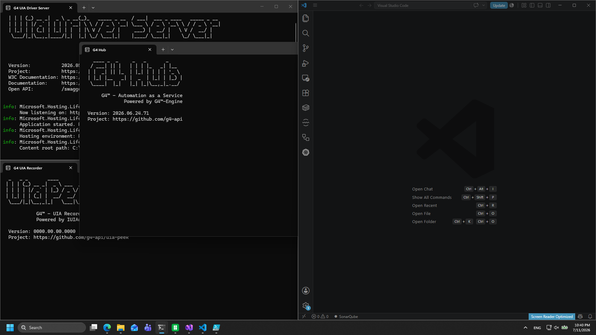

# Module 9: Start the full environment (advanced)

[⬅ Back to overview](README.md)

⏱️ **About 4 minutes** · Advanced

The sandboxed workflow in [Module 2](02-start-vscode.md) is all most people need — VS Code, with the engine and recorders starting on demand. But sometimes you want **everything running up front**: for demos, for debugging, or when you're driving several tools at once. This module covers the heavier options.

In this module, you will:

- Start the whole stack with one file
- Learn what each window is
- Know which individual services you can start on their own

---

## Option A: Start everything at once

**One file launches the full stack** — the engine (hub), both recorders, the browser services, and VS Code:

- **On Windows:** double-click **`start-dev-environment.cmd`**
- **On Linux:** open a terminal in the sandbox folder and run `./start-dev-environment.sh`

> **💡 Tip:** The first launch can take a little longer while everything warms up.

Several windows open on their own. **This is normal — don't close them.**

| Window | What it does |
| --- | --- |
| **G4 Hub** | The engine itself — the "brain" that runs your workflows. |
| **G4 UIA Driver Server** | Lets G4 drive desktop (UIA) applications. |
| **G4 UIA Recorder** | Watches and records actions on desktop apps (port `9955`). |
| **G4 Chromium Recorder** | Watches and records actions in the browser (port `9956`). |
| **VS Code** | Your workspace — it opens by itself. |

The black console windows just show what the tools are doing. You can **minimize** them, but keep them running while you work.

---

## Option B: Start individual services

If you only need one piece, start it on its own from the sandbox folder:

| Script | Starts |
| --- | --- |
| **`start-hub.cmd`** | Just the engine (hub). |
| **`start-uia-driver-server.cmd`** | The UIA driver server (desktop automation). |
| **`start-chrome-node.cmd`** | A Chrome browser node. |
| **`start-recorder.cmd`** | The recorder services. |

> **📝 Note:** For the everyday sandboxed workflow you don't need any of these — the extension starts what a sandbox-attached project needs. Reach for them only when troubleshooting or running a custom setup.

---

## ✔ Check your work

- [ ] `start-dev-environment.cmd` launched the console windows and VS Code, **or** you started only the individual service(s) you needed
- [ ] You did **not** close any running console window

---

**Next** 👉 [Module 10: Configure recorders manually](10-configure-recorders-manually.md) · or **back to** [the overview](README.md)
