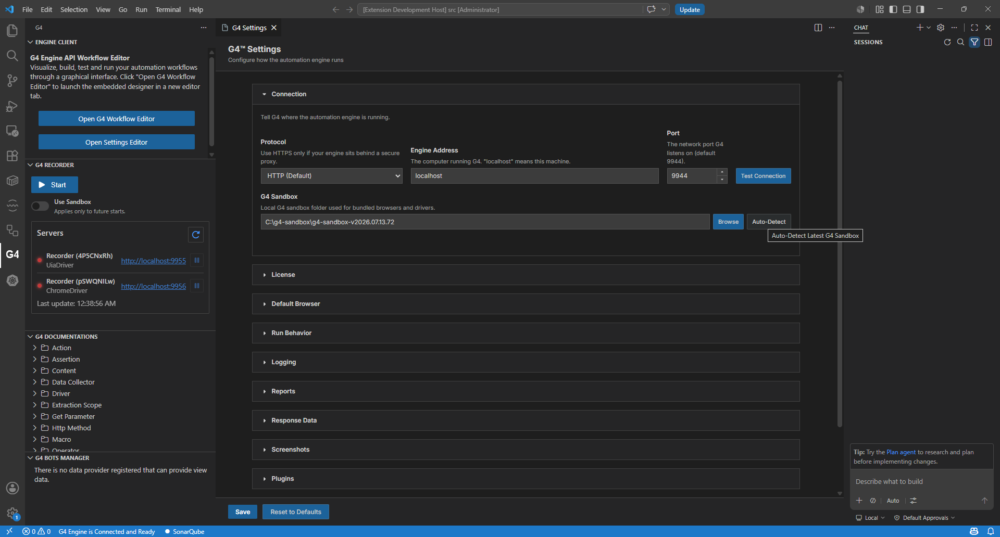
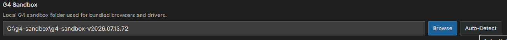

# Module 11: Change your project's sandbox (advanced)

[⬅ Back to overview](README.md)

⏱️ **About 3 minutes** · Advanced

When you created your project in [Module 4](04-create-your-first-project.md), you attached it to a sandbox. Sometimes you need to **change that later** — this module shows how, right from the Settings Editor.

**When you'd do this:**

- You **skipped** the sandbox step at project creation and want to attach one now.
- You **installed a newer sandbox** and want the project to use it.
- You **moved the project** to another machine where the sandbox lives elsewhere.

**What the sandbox controls** (why this matters): the attached sandbox supplies your project's **engine (hub) connection**, its **browser and driver paths**, the recorder's **Use Sandbox** shortcut, and pins the project to a **specific sandbox version**.

In this module, you will:

- Open the Connection settings
- See which sandbox the project currently uses
- Change it with **Auto-Detect** or **Browse**, then save

---

## Step 1: Open the Connection settings

Open the **Settings Editor** (right-click `manifest.json` → **Open Settings Editor**) and expand the **Connection** section. This section is where the project's engine and sandbox live.

Look for the **G4 Sandbox** field — *"Local G4 sandbox folder used for bundled browsers and drivers."* It shows the sandbox the project is currently pointed at.

---

## Step 2: Change the sandbox

Next to the **G4 Sandbox** field are two buttons:

| Button | What it does | When to use it |
| --- | --- | --- |
| **Auto-Detect** | Finds the **newest** `g4-sandbox-*` folder automatically and fills the field. On Windows it scans each drive root (`C:\g4-sandbox\…`, `D:\…`, `E:\…`); on Linux it scans `/opt/g4-sandbox/…`. | **Recommended** — quickest way to jump to your latest sandbox. |
| **Browse** | Opens a folder picker so you can **select a sandbox folder manually**. | When the sandbox is in a custom location, or you want a specific version. |

> **💡 Tip:** To **detach** the sandbox entirely (the equivalent of "Skip"), clear the field. The base files then fall back to their default paths.

---

## Step 3: Save

Click **Save** at the bottom of the Settings Editor to apply the change.

> **📝 Note:** Because the sandbox feeds the **engine connection**, it's worth clicking **Test Connection** (just above, in the same Connection section) after saving, and checking the status bar still reads **G4 Engine is Connected and Ready**.

---

## ✔ Check your work

- [ ] The **Connection** section's **G4 Sandbox** field shows the sandbox you want
- [ ] You set it with **Auto-Detect** or **Browse** (or cleared it to detach)
- [ ] You clicked **Save**
- [ ] The status bar still says **G4 Engine is Connected and Ready**

---

**Back to** 👉 [the overview](README.md)
